#  [神经动力学-P1]第1章 神经元与数学

这一章节的主要目的是介绍一些神经生物学中的基本概念，特别是动作电位(action potentials)，突触后电位(postsynaptic potentials)， 发放阈(firing thresholds) ， 不应性(refractoriness) ，适应性(adaptation)。在此基础上，建立了基础的神经动力学模型，该简单模型(leaky integrate-and-fire 模型)将作为广义的integrate-and-fire模型起始点和参考，这也将作为整本书的主要内容在第二部分(P2)和第三部分(P3)被讨论。因为简单模型的数学本质上是一维线性微分方程，我们以第一章为契机，介绍一些数学概念，这些概念将在本书的其余部分被用到。

由于空间的限制，我们不能对神经生物学这一复杂领域进行了全面的介绍。 因此，本章中生物背景的介绍是高度选择性的，并且集中在那些需要理解在本书中提出的理论工作的生物背景的方面。关于神经生物学的深入讨论，我们请读者参阅本章末尾提到的文献。 

 在1.1和1.2节中回顾了神经元的性质之后，我们将在1.3节中转向我们的第一个数学神经元模型。最后两部分专门讨论简化模型的优势和局限性。 

## 1.1 神经系统的组成

在过去的几百年里，生物学的研究已经积累了大量的关于大脑的结构和功能的详细知识。在神经系统的中枢的基本处理单元是神经元，他们以复杂的方式相互连接在一起。这样的神经元一小部分由Ramon y Cajal(1900年左右的神经生物学的先驱之一)的绘制的图如图1.1所示。我们可以区分很多个细胞体呈三角形或圆形，延伸呈长丝状的神经元。这张图只能让我们对大脑皮层神经元网络一个粗略的景观。实际中，皮层神经元及其连接被聚合在一个由$10^4$多个细胞体和每立方毫米数公里的“导线”组成的密集网络中。跨过大脑的区域，连接模式可能看起来会不同。但是，在所有的区域，不同大小和形状的神经元构成大脑的基本元素。

 然而，大脑皮层并不完全由神经元组成。 除了各种类型的神经元， 有大量的“支持者”细胞，即所谓的神经胶质细胞， 它们是脑组织能量供应和结构稳定所必需的。因为神经胶质细胞不是直接的参与信息处理，我们将不会进一步去讨论。我们也会忽略一些稀有类型神经元，例如，哺乳动物视网膜上的non-spiking神经元。在整本书当中，我们只关注spiking神经元。

 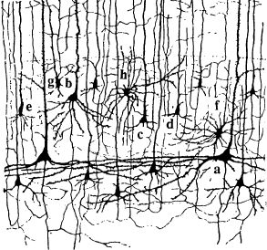 

图1.1： 这幅Ramon y Cajal画的复制品展示了他在显微镜下观察到的哺乳动物皮层中的一些神经元 。通过染色过程，只有一小部分包含在皮层组织样本中的神经元被显现出来，实际的神经元密度要高的多。细胞b是 一种典型的具有三角形细胞体的锥体细胞。树突(Dendrites) ，从它们粗糙的表面可以辨认出它们离开细胞的侧面和上方。 轴突(axons)可辨认为细而光滑的线条，向下延伸，左右两侧各有一些分支。  

### 1.1.1 理想的spiking神经元

一个典型的神经元可以被分为三个明显的功能部分：树突(dendrities)，胞体(soma)，轴突(axon)，如图1.2所示。简而言之，树突扮演着“输入设备”的角色，从其他神经元手机信号并将其传递到胞体。胞体是“中心处理单元”，执行重要的非线性处理过程：如果输入到胞体的总输入超过某一阈值，则产生输出信号。输出信号被“输出设备”接管，即轴突，将信号传递给其他神经元。

在两个神经元之间的间隙叫做突触(synapse). 我们假设神经元通过突触传递信号。通常将发送神经元称之为突触前细胞(presynaptic cell)，而将接受神经元成为突触后细胞(postsynaptic cell)。在脊椎动物的大脑皮层的一个神经元通常与$10^4$个突触后细胞连接。很多的轴突分支直接与附近神经元连接，但是轴突可以伸展到几厘米，以便到达在大脑其他区域的神经元。

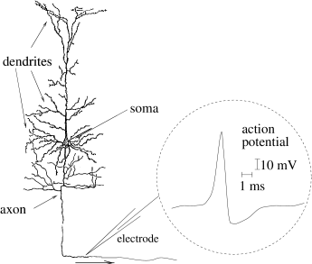 
图1.2：A. Ramon y Cajal画的一个简单神经元。可以清晰的区分树突，胞体，轴突。插图展示了一个神经元动作电位(action potential)例子(示意图)。动作电位是持续时间为1-2ms的短电压脉冲，振幅约为100mv。B.信号从突触前细胞j到突触后细胞i的传导。突触用虚线圆圈标识。右下角的轴突通向其他神经元(原理图)。

### 1.1.2 脉冲序列

神经元信号包含短电位脉冲，可以通过在神经元胞体上或者靠近胞体或轴突处放置精细电极进行观察，如图1.2所示。这个脉冲信号称为动作电位或者spikes，有大约100mv的振幅和1-2ms的持续时间。当动作呆腻味沿轴突传播时，脉冲的形式不会发生变化。由单个神经元发出的一连串的动作电位成为脉冲序列(spike train)-以规则或者不规则的时间间隔发生的定型时间的序列，如图1.3所示。由于一个特定神经元的孤立尖峰看起来很相似，动作电位的形式并不携带任何信息。相反，脉冲的数量和时间更加重要。动作电位是信号传导(signal transmission)的基本单元。

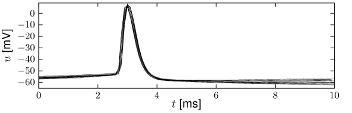 
图1.3: 动作电位是刻板的事件。在最大电压的排列的膜电位记录显示动作电位的形状变化很小。数据由Maria Toledo-Rodriguez和Henry Markram提供。

脉冲序列里的动作电位经常是分开的。即使有非常强的输入，在第一个脉冲发生之中或者之后也不能立即激发第二个脉冲。两个脉冲之间最小距离定义了神经元绝对不应期(refractory)。绝对不应期间之后是相对不应阶段，在此阶段很难激发动作电位，但非不可能。

### 1.1.3 突触

突触前神经元的轴突与突触后神经元的树突(胞体)接触的地方就是突触(synapse)。脊椎动物大脑里最常见的突触类型是化学性突触。在化学性突触中，轴突的终端非常靠近突触后神经元，在突触前细胞膜和突触后细胞膜只留下很小的间隙，这称之为突触间隙(synaptic cleft)。当动作电位到达突触时，它打开一系列复杂的生物化学处理阶段，诱导神经递质(neurotransmitter)从突触前细胞终端释放到突触间隙。只要神经递质分子到达突触后细胞一侧，他们会被突触后细胞膜上的特殊受体识别，进而(直接或者通过生物化学信号链)导致特殊离子通道的打开促使例子从细胞外液流入到细胞内。离子流入会改变突触后一侧的膜电位，最终，化学信号被转换为电反应。突触后神经元到突触前脉冲的电压反应称为突触后电位(postsynaptic potential)。

除了化学突触，神经元也可以通过电突触连接，有些时候称为间隙连接(gap junctions)。特殊的膜蛋白在两个神经元之间形成直接的电连接。关于间隙连接的功能方面的了解并不多，但他们被认为与神经元的同步有关。

### 1.1.4 神经元是大系统的一部分

神经元嵌在构成脑组织的数十亿其他审计官员和胶质细胞的网络中。大脑由不同的区域组成。大脑痞子可以被认为是一个薄但扩展的神经元薄片，折叠在其他大脑结构上。一些皮层区域主要参与处理感觉输入，其他区域参与工作记忆或运动控制。

感知皮层的神经元可以通过实验来表征对刺激的强烈反应。举个例子，初级视觉皮层的神经元只在很小的视觉区域对光点有反应。神经元对刺激敏感的有限制的区域称为神经元感受域(receptive field)(如图1.4)

视觉皮层感受域的简单细胞并不都是同构的，而是有典型的两个或三个细长的子区域。当光点落入其中一个兴奋子区域时，神经元增强它的活动，也就是说，它比没有刺激的神经元发出更多的脉冲信号。当光点落入抑制子区域时，与在灰绿色屏幕上自发活动相比，它的活动要降低了。一个光点实际上并不是最好的刺激。神经元对与兴奋子区域拉长方向一致的运动光棒反应最大。

大量的神经科学文献都是关于确定感觉皮层神经元感受域的。当视觉皮层神经元对适当的视觉刺激反应时，听觉皮层(auditory cortex)或躯体感知皮层(somatosensory cortex)的神经元对听觉或处决刺激反应。如果跳出感知皮层，感受域的概念的定义就变得不太准确。例如，颞下皮层(inferotemporal cortex)神经元对物体的尺寸和位置有独立的反应。在工作记忆任务中，额皮层(frontal cortex)神经元在没有任何刺激期间也是活跃的。在这本书第2，3，4部分，我们将介绍在一个大系统中的神经元网络的感受域和工作记忆。现在，我们回到一个简单的，理想化的神经元。

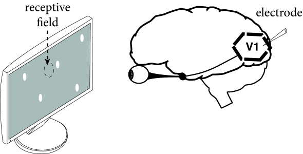 
图1.4：视觉皮层感受域。当光点呈现在灰色屏幕上时，电极监测神经元的活动。神经元发生反应无论何时刺激落在感受域， 用椭圆表示的示意图。

## 1.2 神经动力学的要素

脉冲对后突触神经元得影响可以通过测量细胞内和周围环境的电压差$u(t)$的胞内电极记录下来。这个电位差称为膜电位差(membrane potential)。在没有任何输入的情况下，神经元在静息状态会保持在固定的膜电位差$u_{rest}$。在脉冲到达前，电位会发生变化，最终衰减到静息电位(resting potential), 如图1.5A所示。如果电位变化事正的，那么该突触是兴奋性的。如果电位变化是负的，那么该突触是抑制性的。

在静息状态时，细胞膜已经有大约为-65mv的负极化电压。在兴奋性突触上的刺激减小该膜的负极化电压，因此称为去极化(depolarizing)。在抑制性突触上的刺激增强膜的负极化，因此称为超极化(hyperpolarizing)。

### 1.2.1 后突触电位

现在我们为上述的现象建模。我们关注第i个神经元的膜电位的时间序列$u_i(t)$。在刺激脉冲到达之前，我们有$u_i(t)=u_{rest}$。在$t=0$时，前突触神经元j发放脉冲。当$t>0$，我们可以观察到电极上神经元i的反应为
$$
u_i(t)-u_{rest}=:\epsilon_{ij}(t) \tag{1.1}
$$
公式$(1.1)$右侧定义了后突触电位(postsynaptic potential, PSP)。如果电压差$u_i(t)-u_{rest}$是正(负)的，我们可以得到兴奋性(抑制性)后突触电位EPSP(IPSP)。在图1.5A中，我们可以画出由从神经元通过兴奋性突触到达神经元i导致的EPSP。

 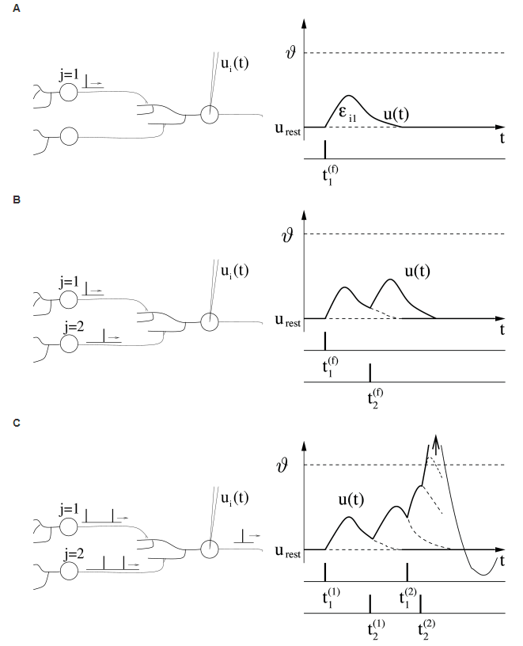 

图1.5: 后突触神经元i接受两个突触前神经元$j=1,2$的刺激。A. 每个前突触脉冲产生一个可以被电极记录为电压差$u_t(t)-u_{rest}$的兴奋性后突触电位(EPSP)。由神经元$j=1$产生的EPSP的时间序列可以表示为$\epsilon_{i1}(t-t_i^{(f)})$。 B. 在神经元$j=1$的脉冲到达后，第二个前突触神经元$j=2$的输入脉冲很快的到达，产生一个可以与第一次后突触电位相加的第二次后突触电位。C. 如果$u_i(t)$打到阈值$\theta$，动作电位就发生了。最终，膜电位开始一个大的正向脉冲偏移(箭头)。在图的电压的尺度，突触的峰值超越了边界。在脉冲发生后，电位会恢复到一个小于静息电位$u_{rest}$的值。

### 1.2.2 发放阈值和动作电位

考虑到两个可以产生脉冲给后突出神经元$i$的突触前神经元$j=1,2$。神经元$j=1$在$t_1^{(1)},t_1^{(2)},\dots$产生脉冲，相似的，神经元$j=$在$t2_2^{(1)},t_2^{(2)},\dots$产生脉冲。每一个脉冲分别激发一个后突触电位$\epsilon_{i1},\epsilon_{ji}$。只要存在少量的刺激脉冲，电位的总变化可以静思等于PSP的总和，
$$
u_i(t)=\sum_j\sum_f\epsilon_{ij}(t-t_j^{(f)})+u_{rest} \tag{1.2}
$$
i.e, 膜电位对输入脉冲反应是线性的，如图1.5B所示。

换而言之，如果在很短的时间内有很多输入脉冲，线性分解会失效。只要膜电位达到重要值$\theta$，它的轨迹展示出了与简单叠加的PSP由巨大区别的行为: 膜电位抑制振幅约为$100mv$的脉冲偏移。这个短电压脉冲将会沿着神经元$i$的轴突传播到与其它神经元连接的突触。在脉冲之后，膜电位不会直接回复到静息电位，对很多神经元类型，反而是穿过一个低于静息值的超极化阶段。

单个EPSP的振幅再1mv的范围内。脉冲的重要值一般高于静息电位20到30mv。在绝大多数神经元中，如图1.5C所示的四种脉冲不能够激发动作电位。相反，大约20-50突触前脉冲需要在很短的时间窗口到达激活后突触动作电位。

## 1.3 Integrate-and-Fire模型

我们在之前的章节中知道，粗略估计下，神经元动力学可以看成是一个求和的过程(有些时候也可以成为整合过程integration process)，与触发超过某些临界电压的动作电位的机制相结合。事实上在实验过程中，放电时间通常定义为膜电位从下面达到某个阈值的时刻。为了构建一个神经元动力学的现象学模型，我们用描述了脉冲起始重要电压的一个标准的阈值$\theta$。如果电压$u_i(t)$(包含所有输出叠加的影响)从下面到达$\theta$，我们可以说神经元$i$产生一个脉冲信号。跨越阈值的时间成为放电时间$t_i^{(f)}$。

该模型利用了一个特定的神经元的动作电位总是有相似模式的事实。如果该动作电位的形状是一样的，那么形状不能被用作传递信息： 与之相法，信息包含在脉冲信号的产生和消失当中。因此，动作电位可以被还原为一个在特定时间发生的事件。

神经元动作电位被描述为事件的模型可以成为Integrate-and-Fire(IF)模型，在该模型中，我们不需要描述动作电位的形状。IF模型有两个必须的且独立的元素来定义神经元的动力学：(I)描述膜电位$u_i(t)$变化的方程；(II)产生脉冲信号的机制。

在下面，我们将使用以下两种成分介绍IF模型类中最简单的模型: (I)线性微分方程描述膜电位的变化; (II)脉冲发放的阈值。该模型成为Leaky Integrate-and-Fire(LIF)模型。将在本书的第二部分讨论的广义的IF模型可以被看作是这个基本模型的变化。

### 1.3.1 输入整合

变量$u_i$描述神经元$i$膜电位的瞬时值。在没有任何输入下，电位就是它的静息电位$u_{rest}$。如果实验人员注入电流$I(t)$到神经元，或者神经元接受其它神经元的突触输入，电位$u_i$将会偏离它的静息电位。

为了得到瞬时电压$u_i(t)-u_{rest}$与输入电流$I(t)$的关系，我们使用电理论的基本定理。神经元被相当完美的绝缘体细胞膜包裹着。如果短的电流脉冲$I(t)$作用到神经元，附加的电荷$q=\int I(t')dt'$一定会到某个地方：它会给细胞膜充电(图1.6A)。细胞膜因此就像是一个电容量为C的电容。因为绝缘体是不安没得，充电会随着时间缓慢的通过细胞膜泄露出去。因此，细胞膜的特征是具有泄露的电阻$R$.

如图1.6所示，基于输入电流$I(t)$，包含电容$C$和电阻$R$的并联电路可以表示LIF模型。

 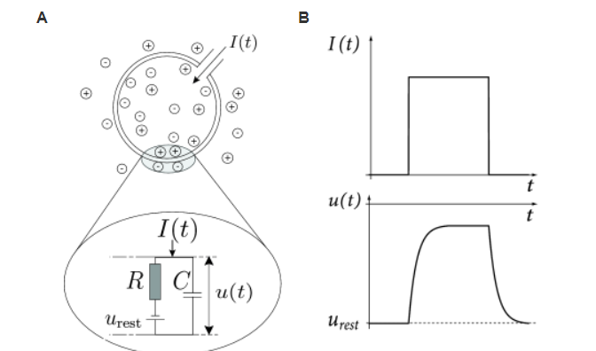 

图1.6：神经元的电路性质：被动膜(passive membrane)。A.被细胞膜包裹的(大环)的神经元接受一个(正)输入电流$I(t)$，增加了神经元内部的电池。细胞膜像是一个电容与线路上有电位$u_{rest}$的电源的电阻并联的电路。B. 细胞膜对阶梯电流(上)起反应，并有平滑的电压轨迹(下)。

如果驱动电流$I(t)$消失，跨电容电压就是电源电压$u_{rest}$。对于电源的生物解释，我们推荐读者阅读下一章节。这里我们简单的添加电源到电路中用来解释细胞的静息电位(如图1.6A)

为了分析电路，我们利用电流守恒定律，将驱动电流分成两个部分
$$
I(t)=I_R+I_C \tag{1.3}
$$
第一个元素是通过线性电阻$R$的电阻电流$I_R$，可以通过欧姆定律$I_R=u_R/R$，其中$u_R=u-u_{rest}$是电阻两端电压。第二个元素$I_C$给电容$C$充电。基于电容的定义$C=q/u$(其中$q$是电子，$u$是电压)，我们发现电容电流可以表示为$I_C=\mathrm{d}q/\mathrm{d}t=C\mathrm{d}u/\mathrm{d}t$，因此
$$
I(t)=\frac{u(t)-u_{rest}}{R}+C\frac{\mathrm{d}u}{\mathrm{d}t} \tag{1.4}
$$
我们将方程(1.4)乘以$R$，引入常数$\tau_m=RC$为泄露积分器。这将生成标准形式，
$$
\tau_m\frac{\mathrm{d}u}{\mathrm{d}t}=-(u(t)-u_{rest})+RI(t) \tag{1.5}
$$
我们称$u$为膜电位，$\tau_m$为神经元膜时间常数。

从数据角度看，方程(1.5)是线性微分方程。从电路工程角度看，它是泄露积分器或者电阻$R$和电容$C$并联的RC电路。从神经科学家角度看，方程(1.5)成为跨膜方程。

所以方程(1.5)的解是什么呢？我们假设，对于任何情况下，在时间点$t=0$，膜电位为$u_{rest}+\Delta u$。当$t>0$时，输入消失$I(t)=0$。直觉上，我们希望，如果我们等待的时间够长，膜电位会逐渐恢复到静息电位的数值$u_{rest}$。实际上，初始条件为$u_(t_0)=u_{rest}+\Delta u$的微分方程的解为
$$
u(t)-u_{rest}=\Delta u\exp(-\frac{t-t_0}{\tau_m}) \quad \mathrm{for}\  t>t_0 \tag{1.6}
$$
因此，在缺少输入的情况下，膜电位会以指数形式下降到静息电位。磨时间常数$\tau_m=RC$是下降的时间。对于典型的神经元，它在10ms的范围，因此与脉冲为1ms的脉冲信号是相当长的时间。

通过对方程两边求导，可以检验解(1.6)的有效性。因为它是在没有输入的情况下的解，所以它有时被称为“自由”解。

### 1.3.2 脉冲输入

 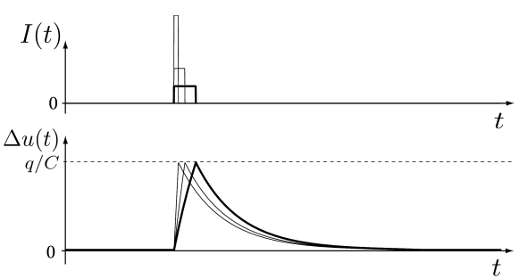

图1.7：短脉冲和总电荷在无源膜上传递。短电流脉冲$I(t)$(上面)驱动的泄露积分器的电压振幅(下面)只取决于总电荷量$q=\int I(t)dt$，而不是电流脉冲的高度。

在我们继续讨论IF模型和它的变种之前，我们先学习定义在方程(1.5)中无源膜动力学的简单例子。假设无源膜被恒定电流刺激$I(t)=I_0$，从$t=0$开始到$t=\Delta$结束。为了简单起见，我们假设膜电位在$t=0$时为静息值$u(0)=u_{rest}$。

首先，我们计算膜电位的时间历程。膜电位的轨迹可以通过整合方程(1.5)，初始条件为$u(0)=u_{rest}$得到。$0<t<\Delta$的解可以表示为：
$$
u(t)=u_{rest}+RI_0[1-\exp(-\frac{t}{\tau_m})] \tag{1.7}
$$
如果输入电流不停止，膜电位(1.7)会随着时间$t\rightarrow \infty$逼近渐进值$u(\infty)=u_{rest}+RI_0$。我们可以通过观察图(1.6)中的RC电路图来理解这个结果。如果达到了稳定的状态，电容上的电荷不会在被充电了。所有的输入电流因此会刘翔电阻。因此，稳定状态时在电阻上的电位为$RI_0$，因此，整个膜电压为$u_{rest}+RI_0$。

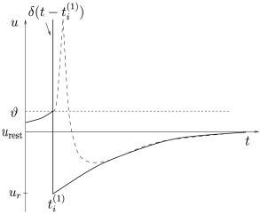

图1.8：在脉冲神经元的标准模型中，动作电位的形状(虚线)通常被脉冲(垂线)代替。在脉冲被膜电位重置到$u_r$值后，负超调(脉冲后电位)。脉冲在$t_i(1)$处通过阈值触发。

#### 例子: 短脉冲和Dirac $\delta$ 函数

对于短脉冲，稳定状态值永远达不到。在脉冲结束时，根据式(1.7)给出膜电位的值是$u(\Delta)=u_{rest}+RI_0[1-\exp(-\frac{\Delta}{\tau_m})]$。对于脉冲持续时间$\Delta\ll\tau_m$(其中，$\ll$是远远小于符号)，我们可以把指数项展开为泰勒级数：$exp(x)=1+x+x^2/2!+\dots$。考虑一阶展开，$x=-\frac{\Delta}{\tau_m}$，我们可以得到
$$
u(\Delta)=u_{rest}+RI_0\frac{\Delta}{\tau_m} \quad \mathrm{for} \ \Delta\ll\tau_m \tag{1.8}
$$
因此，电压偏差线性地依赖于脉冲的振幅和持续时间(图1.7，粗线)。

现在，我们让脉冲的持续时间$\Delta$逐渐变小，同时增加电流脉冲到$I_0=q/\Delta$，这样可以使得$\int I(t)dt=q$依然是常数。换而言之，通过电流传输的总电荷$q$总是相同的。有意思的是，无论我们使脉冲变短，由式(1.8)计算的脉冲末端的电压偏转保持不变。事实上，在式(1.8)中，我们发现$u(\Delta)-u_{rest} =\frac{qR}{\tau_m}=\frac{q}{C}$，其中$\tau_m=RC$。因此我们可以考虑一个无限短脉冲的极限
$$
I(t)=q\delta(t)=\lim_{\Delta\rightarrow0}\frac{q}{\Delta} \quad \mathrm{for} 0<t<\Delta \quad \mathrm{and} \ 0 \ \mathrm{otherwise} \tag{1.9}
$$
$\delta(t)$成为Dirac-$\delta$函数。它的定义为，当$x\ne0, \int_{-\infty}^\infty\delta(x)dx=1$时, $\delta(x)=0$。

显然，Dirac-$\delta$函数是数学抽象的，因为几乎不可能把无限短又无限强的电流脉冲注入到神经元中。无论何时我们使用$\delta$函数，我们应该记住，作为一个独立的对象，它看起来很奇怪，但一旦我们集成它，它就变得有意义了。实际上，定义在式(1.9)的输入电流需要被代入微分方程(1.5)，然后整合。每当脉冲持续时间$\Delta$比时间常数$\tau_m$短的多时候， 电压改变产生的短电流脉冲总是一样的，这样Dirac-$\delta$函数的数学抽象突然就有更多意义了。因此，只要脉冲足够短，脉冲的确切持续时间是无关紧要的。

在$\delta$函数的帮助下，我们不用再担心在应用电流脉冲时膜电位的时间历程:膜电位在时间$t=0$的简单的跳跃$q/C$。因此，这就好像我们立刻在RC电路的电容器上加了一个电荷q。

如果$t>\Delta$会发生什么呢？膜电位在没有输入条件下，从它的新初始值$u_{rest}+q/C$进行演化。因此我们可以用式(1.6)的自由解($t_0=\Delta$和$\Delta u=q/C$)。

我们可以用下面的陈述来总结本小节的注意事项。脉冲输入线性微分方程的求解
$$
\tau_m\frac{\mathrm{d}u}{\mathrm{d}t}=-(u(t)-u_{rest})+Rq\delta(t) \tag{1.10}
$$
对所有的$t\le0$，$u(t)=u_{rest}$
$$
u(t)-u_{rest} = q\frac{R}{\tau_m}\exp(-\frac{t}{\tau_m}) \quad \mathrm{for} \ t>0 \tag{1.11}
$$
方程的右边叫做脉冲响应函数或线性微分方程的Green函数。

### 1.3.3 脉冲发放的阈值

正本书中，激发时间(firing time)表示神经元发放动作电位的时间$t^{(f)}$。IF模型中激发时间$t^{(f)}$用是基于阈值规则定义的
$$
t^{(f)}:\quad u(t^{(f)})=\theta \tag{1.12}
$$
脉冲的形式没有明确的描述。但是，激发时间是有的，在$t^{(f)}$之后立即重置为一个新值你的$u_r<\theta$。
$$
\lim_{\delta\rightarrow0;\delta>0}u(t^{(f)}+\delta)=u_r \tag{1.13}
$$
当$t>t^{(f)}$，在出现下一个阈值交叉之前，动力学再次由方程(1.5)中给出。泄露积分方程(1.5)和重置方程(1.13)定义了LIF模型。在恒电流$I_0$刺激下的LIF电压轨迹如图1.9所示。

对于神经元$i$的激发时间，我们可以写作$t_i^{(f)}$,其中$f=1,2,\dots$是脉冲的标签。通常，我们可以把神经元$i$的脉冲序列表示为放电时间的序列
$$
S_i(t)=\sum_f\delta(t-t_i^{(f)}) \tag{1.14}
$$
其中$\delta(x)$是Dirac$\delta$函数(例子1中所示)，其中，当$x\ne0, \int_{-\infty}^\infty\delta(x)dx=1$时, $\delta(x)=0$。因此，脉冲在时间上退化为点(图1.8)。我们提醒读者，$\delta$函数时数学对象，需要插入到积分中才能得到有意义的结果。

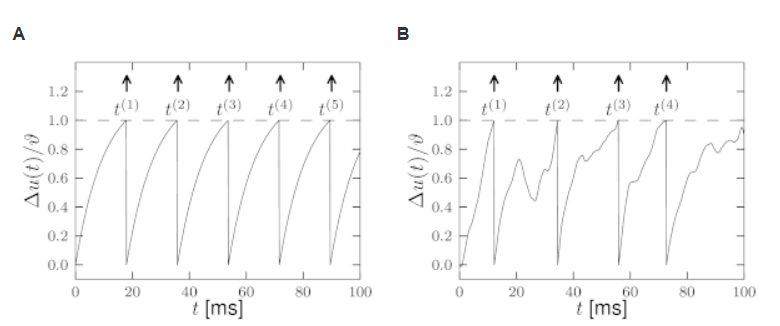

图1.9：IF模型。A.恒电流输入$I_0=1.5$驱动的IF神经元的膜电位随时间的变化。电压$\Delta u(t)=u-u_{rest}$时通过阈值$\theta$标准化得到的。选择输入电流单元，使$I_0=1$对应于到达$t\rightarrow\infty$阈值的轨迹。在脉冲之后，电位被复位到$u_r=u_{rest}$。B. 输入电流随时间变化的电压响应。

### 1.3.4 时间相关输入

我们研究由任意时间相关输入电流$I(t)$驱动的LIF模型，如图1.9B所示。发放阀(firing threshold)的值为$\theta$，之后，发放电位会被重置为$u_r<\theta$.

在阈值的确实条件下，线性微分方程(1.5)的解为：
$$
u(t)=u_{rest}+\frac{R}{\tau_m}\int_0^\infty\exp(-\frac{s}{\tau_m})I(t-s)ds \tag{1.15}
$$
其中，$I(t)$时任意的输入电流，$\tau_m=RC$时膜时间常数。我们假设，输入电流的定义可以追溯到过去很长一段时间：$t\rightarrow-\infty$，因此我们不需要担心初始条件。两个时间相关电流，如正弦信号$I(t)=I_0\sin(\omega t)$或者阶梯电流信号$I(t)=I_0\Theta(t)$, 其中$\Theta$表示，Heaviside阶跃函数(当$t\le0, \Theta(t)=0$; 当$t>0, \Theta(t)=1$。方程解(1.15)对其它的时间相关的输入电流也是有效的。

目前为止，我们泄露积分器还没有阈值。如果方程解(1.15)有阈值$\theta$，每一次膜电位达到阈值，变量$u$从$\theta$重置为$u_r$。在电路中，电位重置与移除电容充电源$q_r=C(\theta-u_r)$相关，或者，等效的，添加一个电容负充电源$-q_r$。因此，重置与在时间$t^{(f)}$时刻的短电流脉冲$I_r=-q_r\delta(t-t^{(f)})$相关。实际上，神经元“fires”而不是“discharges”的说法并不罕见。因为每次神经元被触发时重置就会发生，所以重置电流是，
$$
I_r=-q_r\sum_f\delta(t-t^{(f)})=-C(\theta-u_r)S(t) \tag{1.16}
$$
其中，$S(t)$表示脉冲序列，如公式(1.14)。

短电流脉冲及其放电过程就像处理其他随时间变化的输入电流一样。总电流$I(t)+I_r(t)$，包含刺激电流和重置电流，带入到公式解(1.15)中，可以得到下面结果，
$$
u(t)=u_{rest}+\sum_f(u_r-\theta)\exp(-\frac{t-t^{(f)}}{\tau_m})+\frac{R}{\tau_m}\int_0^\infty\exp(-\frac{s}{\tau_m})I(t-s)ds \tag{1.17}
$$
其中，激发时间$t^{(f)}$可以通过阈值条件定义：
$$
t^{(f)}=\{t|u(t)=\theta\} \tag{1.18}
$$
注意，根据我们在公式(1.9)中对Dirac定值函数的定义，放电复位紧随阈值越过之后，这样事件的自然顺序—首先点火，然后复位。

公式(1.17)看起来相当复杂。可是，这只是一个简单的介绍。在1.3.2章节中，我们已经看到了，在时间$t'$的短输入脉冲会导致$t$时刻的膜电位反应到$\exp(-\frac{t-t'}{\tau_m})$，有时候称之为脉冲反应方程或者Green函数。在公式(1.17)右侧的第二项时在重置时刻的放电电流脉冲。

为了解释右边最后一项，我们考虑刺激电流$I(t)$为包含一系列快速反应的离散的短电流脉冲。在离散时间里，不同步骤下游不同的电流脉冲。因为微分方程时线性的，所有的短电流脉冲的影响时可以叠加的。当我们从离散时间回到连续时间，脉冲反应函数的叠加就变成了积分项，也就是方程(1.17)右侧项。

### 1.3.5 线性微分方程 vs 线性滤

LIF模型可以定义为方程(1.5):
$$
\tau_m\frac{\mathrm{d}u}{\mathrm{d}t}=-(u(t)-u_{rest})+RI(t) \tag{1.19}
$$
与重置条件
$$
\lim_{\delta\rightarrow0;\delta>0}u(t^{(f)}+\delta)=u_r \tag{1.20}
$$
其中，$t^{(f)}$时激发时间：
$$
t^{(f)}=\{t|u(t)=\theta\} \tag{1.21}
$$
与我们在之前的章节看到，线性方程可以被整合得到解(1.17)。可以很方便的重写解如下所示：
$$
u(t)=\int_0^\infty\eta(s)S(t-s)ds+\int_0^\infty \kappa(s)I(t-s)ds \tag{1.22}
$$
其中，我们介绍滤波器$\eta(s)=(u_r-\theta)\exp(-\frac{s}{\tau_m})$和$\kappa(s) =\frac{1}{C}\exp(-\frac{s}{\tau_m})$。有趣的是，方程(1.22)比LIF模型更加泛化，因为滤波器不需要是指数的，可以是任意形状的。滤波器$\eta$描述膜电位的重置，更广泛的说，解释了神经元的不应性(refractoriness)。滤波器$\kappa$总结了膜的线性电路性质。公式(1.22)与阈值条件(1.21)是脉冲反应模型(Spike Response Model)和广义线性模型(Generalized Linear Model)的基础，这些将在第二部分被讨论。

### 1.3.6 周期驱动和傅里叶变换

形式上，实值函数$f(t)$的复傅里叶变换在实线上的参数是$t$:
$$
\hat{f}(\omega)=\int_{-\infty}^\infty f(t)e^{i\omega t}dt=|\hat{f}(\omega)|e^{i\phi_f(\omega)} \tag{1.23}
$$
其中，$|\hat{f}(\omega)|$和$\phi_f(\omega)$分别是傅里叶变换在频率$\omega$时的振幅和相位。定义良好的傅里叶变换的数学条件是函数$f$是Lebesgue可积分，$\int_{-\infty}^\infty|f(t)|<\infty$。如果$f$是时间的函数，那么$\hat{f}(\omega)$是频率的函数。傅里叶反变换从频率空间返回到原始空间，也就是时间。

对于线性系统，上述的定义对傅里叶变换方程给出了几个方便的规则。例如，我们考虑下面的系统
$$
u(t)=\int_{-\infty}^\infty \kappa(s)I(t-s)ds  \tag{1.24}
$$
其中，$I(t)$是实数输入(电流)，$u(t)$是实数系统输出(电压),$\kappa$是线性反省滤波器或者核函数(对于所有的$s<0$，$\kappa(s)=0$)。方程(1.24)右侧的卷积变换之后在傅里叶变换中成为一个简单的相乘，计算步骤如下
$$
\begin{align}
\hat{u}(\omega)&=\int_{-\infty}^\infty[\int_{-\infty}^\infty \kappa(s)I(t-s)ds]e^{-i\omega t}dt \\
&=\int_{-\infty}^\infty\int_{-\infty}^\infty \kappa(s)e^{-i\omega t}I(t-s)e^{-i\omega (t-s)}dsdt \\
&=\hat{\kappa}(\omega)\hat{I}(\omega)
\end{align} \tag{1.25}
$$
其中，我们介绍最后一步的变量$t'=t-s$，使用(1.23)中定义的傅里叶变换。

相似的，函数$u(t)$的微分$du/dt$可以用积分乘积规则被写成傅里叶变换形式。$u(t)$微分的傅里叶变换是$i\omega\hat{u}(\omega)$。

虽然这里是作为一个纯粹的数学运算来介绍的，但是在由周期输入驱动的物理系统中可视化傅里叶变换通常是很方便的。考虑到方程(1.24)的线性系统有输入
$$
I(t)=I_0e^{i\omega t} \tag{1.26}
$$
对这个符号做一个简短的注释。如果输入时电流，那么它时实数，而不是复数。因此，我们需要$I_0$是正实数，也就是关注方程(1.26)的实数部作为物理输入。当我们执行复数的计算，我们隐式的假设，在计算最后，我们只取解的实部。然而，使用复数进行计算对于中间的步骤来说是很方便的。

将周期驱动代入方程可以得到，
$$
u(t)=\int_{-\infty}^\infty \kappa(s)I_0e^{i\omega (t-s)}ds=[\int_{-\infty}^\infty \kappa(s)e^{-i\omega s}ds]I_0e^{i\omega t} \tag{1.27}
$$
因此，如果输入时频率为$\omega$的周期信号，那么输出频率为$\omega$的周期信号。中括号里的那一项时线性滤波器的傅里叶变换。我们可以写成$u(t)=u_0e^{i\phi_{\kappa}(\omega)}e^{i\omega t}$。输出幅值与输入幅值之比为
$$
\frac{u_0}{I_O}=|\hat{\kappa(\omega)}| \tag{1.28}
$$
线性滤波器$\kappa$傅里叶变换的相位$\phi_{\kappa}(\omega)$对应于输入和输出之间的相移，或者换一种说法时延迟$\Delta=\phi_\kappa(\omega)/\omega = \phi_\kappa T/2\pi$，其中$T$时震荡周期。傅里叶变换将在书的第三部分的神经元连接网络的信号处理特性的讨论中发挥作用。

#### 例子: 无源膜的周期驱动

我们考虑定义在方程(1.5)的无源膜的微分方程，选择电压单元$u_{rest}=0$，
$$
\tau_m\frac{\mathrm{d}u}{\mathrm{d}t}=-u(t)+RI(t) \tag{1.29}
$$
方程(1.29)的解对应于输入$I(t)$于因果线性滤波器$\kappa(s)=(1/C)e^{-s/\tau_m}$，($s>0$)的卷积。为了确定对周期驱动$I(t)=I_0e^{i\omega t}$的反应幅度$u_0$，我们计算$\kappa$的傅里叶变换：
$$
|\hat{\kappa}(\omega)|=|\frac{1}{C}\int_0^\infty e^{\frac{-t}{\tau_m}}e^{-i\omega t}dt|=\frac{1}{C}|\frac{1}{1+i\omega\tau_m}| \tag{1.30}
$$
因为，$\omega\tau_m\gg1$, 右边近似为$\omega^{-1}$。因此，周期输入信号反应的振幅随着频率升高而下降。

## 1.4 LIF模型的局限性

在1.3章节介绍的LIF模型高度简化，忽略了神经元动力学的许多方面。特别地，突触前神经元或电流注入的输入是线性积分的，与突触后神经元的状态无关:
$$
\tau_m\frac{\mathrm{d}u}{\mathrm{d}t}=-(u(t)-u_{rest})+RI(t) \tag{1.31}
$$
其中，$I(t)$时输入电流。此外，每次输出脉冲后，膜电位复位，
$$
\mathrm{if} \ u(t)=\theta \quad \mathrm{then} \quad \lim_{\delta\rightarrow0;\delta>0}u(t^{(f)}+\delta)=u_r \tag{1.32}
$$
这样以前的脉冲就不会被保留了。让我们列出到目前为止所讨论的简化模型的主要限制。所有这些限制都将在本书第二部分中提出的LIF模型的扩展中得到解决。

### 1.4.1 适应、爆发和抑制性反弹

为了实验地研究神经元动力学，神经元可以被隔离和刺激电流注入通过细胞内电极。在标准的实验技术，我们可以施加一个刺激在$t_0$时刻从电流$I_1$到切换到$I_2$的电流。那我们假设$I_1=0$,神经元处于静止状态$t<t_0$。如果电流$I_2$足够大，它会激发脉冲当$t>t_0$。绝大多数的神经元都会对当前步骤反应，产生脉冲序列，峰值之间的间隔不断增加，直到达到稳定的周期性发射状态，如图1.10所示。表现出这种适应性的神经元被称为规律性放电神经元(regularly-firing neurons)。适应性时一个缓慢的过程，需要经历过几个脉冲。因为在每一个脉到达相同的值时候，标准的LIF模型重置神经元电压，并重启整个过程。没有记忆被保留超过最近的脉冲。因此，LIF神经元不能解释适应性(adaption)。详细的神经元模型将会在第二章讨论，明确的描述这个缓慢过程导致适应性。为了在IF神经元中模拟这些过程，我们需要在过去增加一些脉冲的不应性(refractoriness)的影响。我们将会在第六章看到，这个可以通过式(1.22)中滤波器框架下的滤波器$\eta$解决。或者通过结合LIF模型的微分方程和在第六章中描述的由变量进化更慢的微分方程描述。

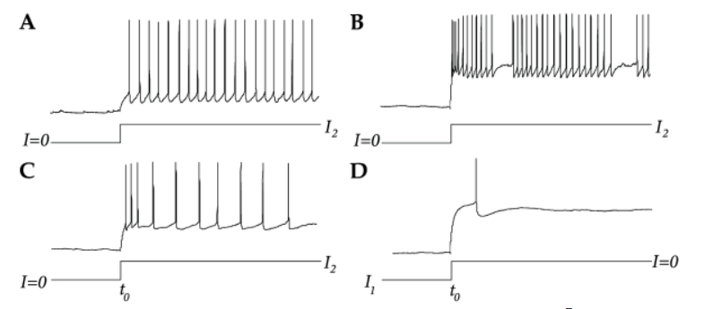

图1.10：响应当前步骤。在图A-C中，电流在$t=t_0$时候切换到$I_2>0$。快速脉冲神经元(A)由更短的无适应性的脉冲间隔，但是规则脉冲神经元(C)表现出适应性，随着脉冲间隔时间的增加而可见。图B中显示了一个结巴神经元的例子。很多神经元会发出一种抑制性反弹(D)在抑制电压$I_1<0$切换掉之后。数据由Henry Markram和Maria Toledo-Rodriguez提供。

第二类神经元式快速脉冲神经元(fast-spiking neurons)。这些神经元没有适应性(图1.10A)，因此可以用无适应IF模型来逼近。很多抑制神经元都是快速脉冲神经元。除了规则脉冲和快速脉冲神经元，还有爆炸式(bursting)和结巴式(shuttering)神经元，他们形成了一个单独的集体。这些神经元对一系列脉冲信号的持续刺激作出反应，这些脉冲信号周期性地(爆裂)或非周期性地(口吃)被相当长的时间间隔打断(图1.10B)。同样，除了最近的脉冲外，没有记忆的神经元模型不能描述爆炸，但是式(1.22)中带有任意“过滤器”的框架已经足够普遍地解释爆炸。

另外一个经常观察到的现象式后抑制反弹(post-inhibitory rebound)。考虑阶跃电流，$I_1<0$,$I_2=0$，抑制输入在时间$t_0$被移除(图1.10D)。大部分神经元对该变化反应为一个或者更多的反弹上涨：甚至抑制的释放也能触发动作电位。我们会在第3章重新讨论抑制的现象

### 1.4.2 分流抑制和反转电位

在前面的段落里，我们关注单个神经元被电流刺激的情况。在真实情况下，神经元式存在于一个大网络中，接受大量其它神经元的输入。假设在时间$t_j^{(f)}$,从突触前神经元$j$接收一个脉冲到后突触神经元$i$。当我们在图1.5中介绍后突触电位时，它时在突触中脉冲到达后产生的，它的形状和振幅与后神经元$i$状态无关。当然，这是一种简化，实际情况稍微复杂一些。在第3章中，我们会讨论详细的神经元模型来描述突触输入作为改变膜电导的因素情况。这里我们简单的总结主要的现象。

在图1.11中，我们描绘了一个实验，其中神经元被恒电流$I_0$驱动。我们假设$I_0$很微弱，不能激起发放，在休息一段时间后，膜电位固定在常数$u_0$。在时间$t=t^{f}$，其中一个前突触神经元产生一个脉冲，很短时间内，这个动作电位到达突触，提供额外的刺激给后突出神经元。更准确的说，脉冲在后突触(postsynaptic current PSC)神经元产生电流脉冲, 其振幅为
$$
PSC \propto[u_0-E_{syn}]
$$
其中，$u_0$时膜电位，$E_{syn}$时突触的逆转电位(reversal potential)。因为电流输入的振幅由$u_0$决定，后突触电位的反应也是这样的。逆转电位将会系统在第2章中介绍。突触的模型将会在3.1章节讨论。

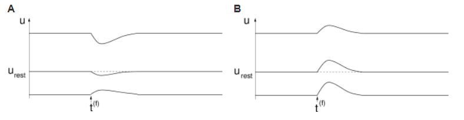

图1.11:后突触电位形状由去极化的瞬时水平决定的。A:当神经元处于静止状态时，在$t^{(f)}$时刻到达抑制性突触的突触前脉冲对膜电位几乎没有影响，但是如果膜电位$u$在静息电位上，将会由很大的影响。如果膜电位时超极化在抑制突触的反转电压下，前突出输入的反应改变符号。B: 兴奋性突触上脉冲激发后突触电位，其振幅只稍微依赖于瞬时电压u。对于大去极化神经元，振幅饱和并变小。

#### 例子：分流抑制(Shunting inhibition)

后突触反应对神经元瞬间状态的依赖性在抑制性突触中最为明显。抑制性突触$E_{syn}$的反转电压在下面，但是一般接近静息电位。因此，如果神经元在静息状态，输入脉冲对膜电位基本上没有影响(图1.11A)。但是，如果膜电位时去极化，很相似的输入脉冲会激发一个很大的抑制性后突触电位。如果膜已经超极化，输入的脉冲会产生一个去极化效应。有一个中间值$u_0$=$E_{syn}$ -反转电位-此处抑制输入的响应从超极化到去极化。

尽管抑制性输入对膜电位由很小的影响，可显著提高细胞膜的局部电导率。抑制性突触一般存在于胞体或者在树突的树干上。由于它们的分布位置，一些抑制性输入脉冲可以“分流”树突树从数百个兴奋性突触中收集到的全部输入。这种现象叫做分流抑制。

兴奋性神经元的反转电位一般显著的在静息电位之上。如果膜去极化$u_0\gg u_{rest}$，兴奋性后突触电位的振幅会降低，但是影响不如抑制性那么明显。因为EPSP极其高层次的去极化饱和会被观察到(图1.11B)。

### 1.4.3 电导在脉冲后发生变化

后突触电位的形状不只是取决于去极化的程度，而且更一般是决定于神经元内部状态。(即相对于先前动作电位的时间)

假设动作电位发生在$t_i^{(f)}$时刻，突触前的脉冲在$t_j^{(f)}>t_i^{(f)}$时刻到达突触$j$。后突触电位现在由时间$t_j^{(f)}-t_i^{(f)}$决定(图1.12)。如果突触前脉冲出现在后突触动作电位期间或之后不久，它几乎没有影响因为一些参与发放动作电位的离子通道会持续打开。如果输入脉冲到达要晚的多，它产生一般大小的后突触电位。我们在第2章重新讨论这个影响。

### 1.4.4 空间结构

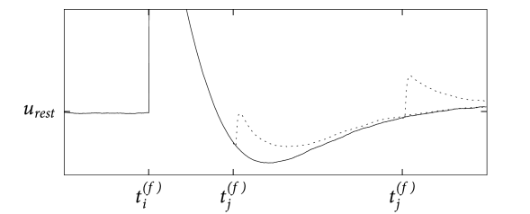

图1.12：后突触电位的形状(虚线)由自上一次神经元i输出峰值以来的时间$t-t_i^{f}$决定的。后突触脉冲在$t_i^{(f)}$被打开。在时间$t_j^{(f)}$到达的前突触脉冲对后突触神经元的影响要小于较晚到达的突触后神经元。数据由Thomas Berger提供。

后突触电位的形式也由突触在树突上的位置决定的。离胞体更远的的突触会产生更小的在胞体后突触反应。如果一些输入在几毫秒内发生在树突分支上，第一个输入会产生膜电位的局部变化，它会影响稍晚到的输入脉冲的反应振幅。这可能会导致饱和，或者在所谓的“主动”电流的情况下增强反应。不同的前突触脉冲的非线性连接在LIF模型中被忽略。虽然纯线性树突可以纳入模型的“过滤器”描述中，我们会在第6章中看到，非线性连接是不能做到的。突触电流的强非线性增强发生在树突上的小区域有时候称为热点(hot spot)。这样的提升会产生树突脉冲，与正常的身体动作电位相比，动作电位持续几十毫秒。

## 1.5 进一步探索IF模型 

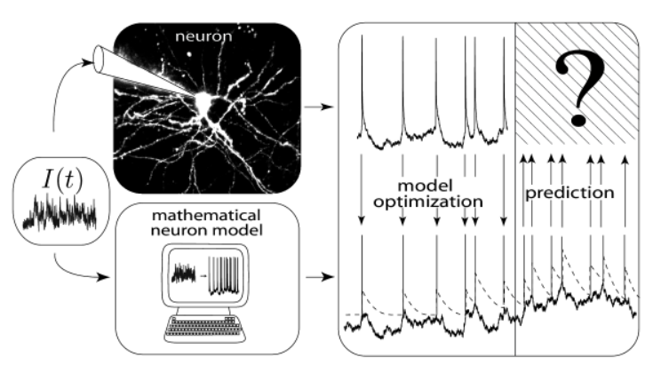
图1.13：脉冲时间预测的挑战。电流$I(t)$是通过电极实验性的输入到神经元胞体。记录神经元的反应，一半的反应是通过模型优化产生的，其它的依然是是不清楚的。挑战就是使用输入电流$I(t)$来预测数学神经元模型的隐藏反应的脉冲时间。

LIF模型是极其简单的神经元模型。正如我们在之前章节中看到的那样，它忽略了很多神经科学家在研究活体大脑或者大脑切片时观察到的很多特征。因此，问题出现了：我们应该从这个模型中得到什么呢？显然的，我们不能期望它能够完整的解释神经元的生物化学和生物物理的特性。我们也不能期望它能够解释由在树突上热点的活跃电流导致的高度非线性连接。但是，IF模型在产生脉冲时是相当准确的，精准事件发生时间。因此，它潜在的可以成为一个有效的模型，在神经元中产生脉冲。

脉冲产生模型的需求是很合理的，它应该又能预测真实神经元脉冲的发生的时间。让我们看图1.13。用电极实验性的注入时间相关的输入电流$I(t)$到皮层神经元胞体。用第二根独立电极来记录神经元胞体电压。不足为奇的是，电压轨迹不时包含尖锐的电脉冲。这些是动作电位或脉冲。

友好的数学神经科学家现在采用时间历程输入电流$I(u)$，该电流结合神经元的膜电位的时间历程，调整LIF模型的参数，以至于，该模型可以为极其相似的输入电流在相近的时间产生脉冲信号，和真实的神经元类似。这需要对参数的调试，但是看起来是可行的。但是，相关且更加困难的问题是现在神经元模型是否可以被用来预测给定一种新的，没有经过参数优化的时间相关的输入电流的真实神经元的发放时间。

类似上面的讨论，神经元不仅仅表现出脉冲之后的不应性，而且展示了需要几百毫秒的适应性。简单的LIF模型不能很好的预测真实神经元的脉冲时间。但是，如果适应性和不应性被加入神经元模型，预测将会变得非常好。更直接的方式去添加适应性是构建神经元发放阈值动力学模型：在每个脉冲之后，阈值$\theta$增加$\Delta\theta$，在静止期间，阈值近似于饱和值$\theta_0$。我们可以用Dirac-$\theta$函数来阐述这个想法：
$$
\tau_{adapt}\frac{\mathrm{d}}{\mathrm{d}t}\theta(t)=-[\theta(t)-\theta_0]+\Delta\theta\sum_f\delta(t-t^{(f)}) \tag{1.34}
$$
其中，$\tau_{adapt}$是适应性的时间常数(几百毫秒), $t^{(f)}=t^{(1)},t^{(2)},\dots$是神经元的发放时间。

自适应阈值IF模型的预测与真实神经元的电压轨迹非常吻合，如图1.14中所示。如何构造实用的，有效的简单IF模型的泛化是第二部分的主要讨论的问题。另外一个问题是如何去衡量这样神经元模型的性能。

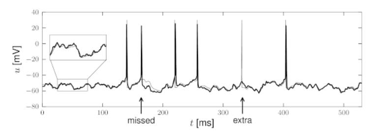
图1.14：与有实验轨迹的广义IF模型模型相比。在由波动电流刺激的真实神经元中记录的电压路径(细黑轨迹)叠加在由广义IF模型(细线)，相同的电流产生的电压轨迹上。阈下电压波动被准确的预测出来，脉冲时间在平均上也可以被很好的预测，除了极少的额外的或者错过脉冲(箭头)。

一旦我们已经识别出好的候选神经元模型，我们会在第三部分讨论我们是否可以用这些模型构建大量神经元的动力学模型，是否可以用这些模型来理解动力学和计算准则，以及大量神经元使用的隐藏神经元代码。事实上，我们将会看到，从可信的单神经元模型过渡到有结构的大量的神经元是由可能的。这并不意味着我们能够理解整个大脑，但是从充分测试的简化神经元模型中理解大群神经元的准则式是在这个方向上首先且重要的一步。

## 1.6 总结

神经信号包含了短电压脉冲，称为动作电位或者脉冲。这些脉冲通过轴突传播并分配到很多后突触神经元，进而激发后突触电位。如果后突触神经元在很短时间内接收到前突触神经元足够数量的脉冲，它的膜电位可能达到关键值，动作电位也就发生了。我们说神经元发放了一个脉冲。该脉冲式神经元输出信号，也会被传递到其它神经元。

一个关于脉冲神经元的特别简单的模型是LIF模型。首先，线性微分方程描述了输入电流如何整合，转化为膜电压$u(t)$。这里输入可以是实验人员注入到单独神经元的输入电流或者是由从其它神经元传输来的突触输入电流。其次，当膜电压达到阈值$\theta$时，模型神经元产生输出脉冲。最后，在脉冲产生后，线性微分方程的整合重置为静息电位$u_r$.

简单的LIF模型并不能解释长时间不应性或者适应性。但是，如果LIF模型的电压动力学模型增强它的适应性机制，那么它将会是一个强大的工具去预测皮层神经元脉冲发放的时间。这类广义的整合-点火模型是本书第二部分的主要主题。

## 参考章节

[1] https://neuronaldynamics.epfl.ch/online/Ch1.html

