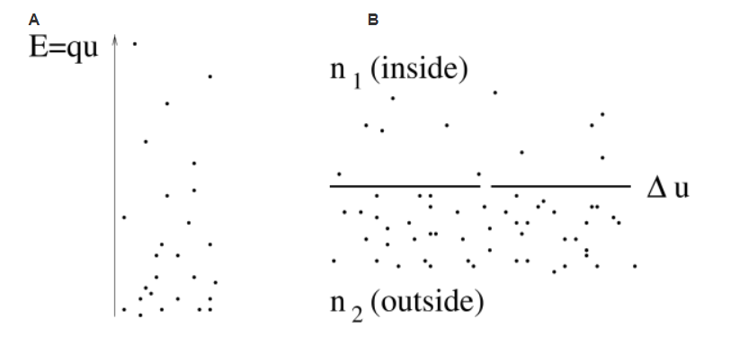

# [神经动力学-P1]第2章 离子通道和HH模型

从生物物理的角度，动作电位是通过细胞膜的离子通道的电流产生的。在对乌贼巨大轴突的一系列广泛实验中，Hodgkin和Huxley成功的测量了这些电流，尝试用微分方程描述动力学变化。在1952年发表的文章里用展示了与简洁的数学理论结合的漂亮实验被认为是开创性的工作，最终导致Hodgkin和Huxley在1963年获得诺贝尔奖。在这个章节回顾了HH模型，并通过几个例子说明一些例子。

HHM原始模型只描述了三种离子通道。最后，我们会在章节2.3中看到，该模型可以被扩展到其它类型的离子通道。HH方程是详细神经元模型的基础，能够解释不同类型的突触和单个神经元的空间几何。树突的突触动力学和空间结构是第3章的主题。HHM也是第4章中推导简单神经元模型的出发点，将作为贯穿本书第二部分中关于GLM(Generalized Integrate-and-Fire Model)讨论的参考。

在我们开始讨论HH方程之前，我们需要给出一些离子通道平衡电位(equilibrium potential)补充知识。

## 2.1 平衡电位

神经元像其它细胞一样被细胞膜包裹着，将细胞内质与细胞外空间分开。细胞内离子的密度与周围液体的密度是由差异的。浓度的差异产生电位，这在神经动力学中扮演很重要的角色。在该节中，我们想提供一些背景知识，给出平衡电位的直观解释。

### 2.1.1 Nernst电位

从神经动力学理论，我们知道，分子处于能量$E$状态的概率与玻尔兹(Boltzmann)曼因子成正比$p(E) \propto \exp(-E/kT)$，其中$k$是玻尔兹曼常数，$T$是温度。让我们考虑静电场中电荷为$q$的正离子。在位置$x$的能量是$E(x)=qu(x)$，其中$u(x)$是在$x$位置的电位。因此，在$x$周围区域找到一个离子的概率正比于$\exp[-qu(x)/kT]$。因为离子的数量很大，我们可以用离子密度来解释这个密度。对于正电荷$q(q>0)$的离子，在低电位$u$处的离子密度要更高。让我们写出在$x$处离子密度$n(x)$。在$x_1$点和$x_2$点的密度关系可以表示为
$$
\frac{n(x_1)}{n(x_2)} = \exp[-\frac{qu(x_1)-qu(x_2)}{kT}] \tag{2.1}
$$
因此，电位差$\Delta u = u(x_1)-u(x_2)$产生离子密度的差异，如图2.1所示。

图2.1：A.平衡电位，电场中正离子的分布，使高能量离子少，低能离子多。因此，电压差产生密度梯度。B.相似地， 离子浓度的差异产生电位差。在神经元内密度$n_2$与周围密度$n_1$是不同的。由此产生的电位称为Nernst电位。实线表示细胞膜。离子可以通过缝隙穿过。

因为这是关于平衡电位的介绍，反之也应该是对的。离子密度的差异产生差异电位$\Delta u$。我们考虑离子的两个密度分别为$n_1$和$n_2$的区域，如图2.1B所示。解方程(2.1)，密度差产生的电位差表示为
$$
\Delta u = \frac{kT}{q}\ln\frac{n_2}{n_1} \tag{2.2}
$$
称为Nernst电位。

### 2.1.2 反转电位

细胞膜由一层薄的双分子层脂质组成，是近似完美的电绝缘体。但是，嵌入在细胞膜内的特定神经元作为离子门(ion gates)。第一种类型的门是离子泵(ion pumps)，第二种是离子通道(ion channels)。离子泵主动传输离子从一侧到另外一侧。结果，细胞内离子浓度不同于周围浓度。举个例子，人类神经元内钠离子浓度($\approx10\mathrm{mM}$)比细胞外液浓度($\approx145\mathrm{mM}$)低。另一方面，胞内钾离子浓度($\approx140\mathrm{mM}$)别外液($\approx5\mathrm{mM}$)高。Hodgkin和Huxley所研究的乌贼的巨大轴突，其数量略有不同，但基本观点是相同的: 细胞外的钠比细胞内的多，而钾的情况则相反。

让我们先关注下钾离子。在平衡状态，密度差产生大约为$+67\mathrm{mV}$的Nernst电位$E_{Na}$。也就是，在平衡状态，细胞内相对于细胞周围有正向电压。细胞内和周围液体通过离子通道连接，其中$\mathrm{Na}^+$可以从一侧通过到达另一侧。如果电压差$\Delta u$比Nernst电位$E_{Na}$要小，更多的$\mathrm{Na}^+$会流入细胞，进而降低密度差。如果电位差大于Nernst 电位，离子会流出细胞。因此电流的方向是反向的，当$\Delta u$通过$E_{Na}$时。因为这个原因，$E_{Na}$称为方向电位(Reversal potential)。

#### 例子：钾(Potassium)的反转电位

像上面提到的，钾离子浓度在细胞内($\approx140\mathrm{mM}$)比细胞外液($\approx5\mathrm{mM}$)高。钾离子有正电荷$q=1.6\times10^{-19}C$。代入方程(2.2)的Nernst方程，其中玻尔兹曼函数为$k=1.4\times10^{-23}$，在室温条件下，产生$E_K\approx -83 \mathrm{mV}$。钾离子的反转电位时负的。

#### 例子： 静息电位

## 2.2 Hodgkin-Huxley Model

## 2.3 离子通道动物园

## 2.4 总结

