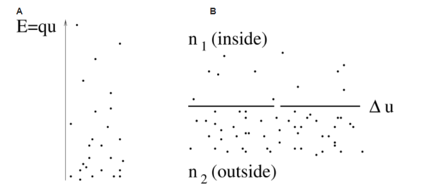
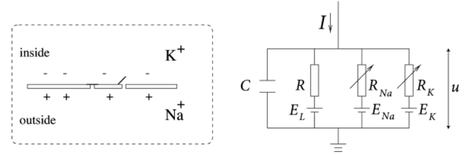
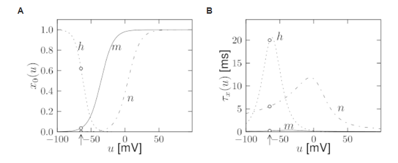
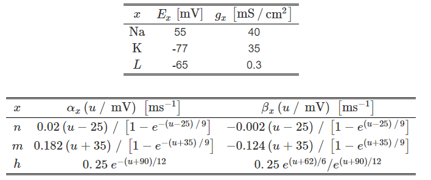
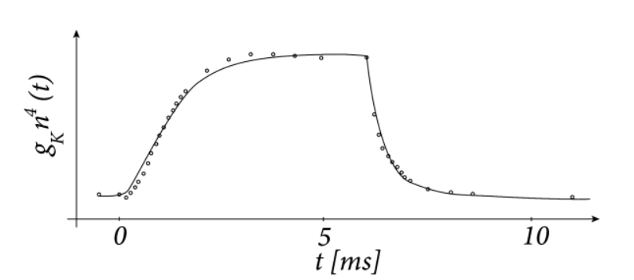
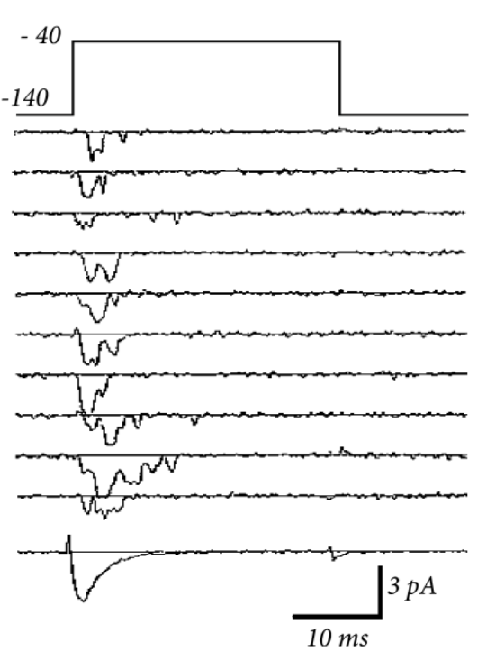
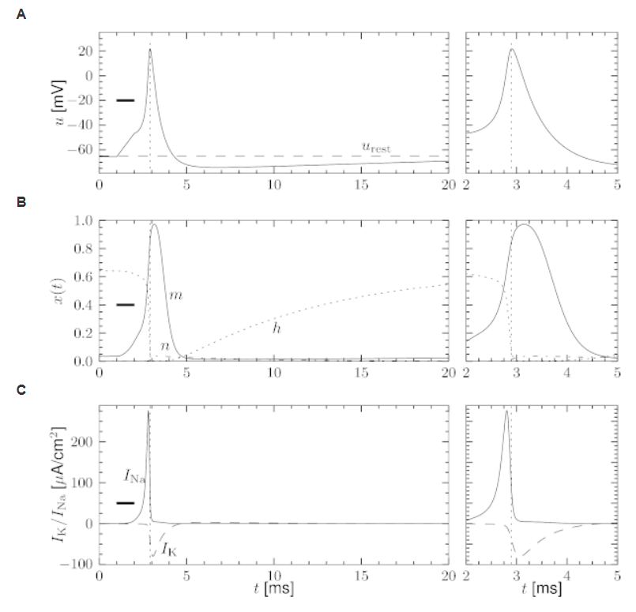
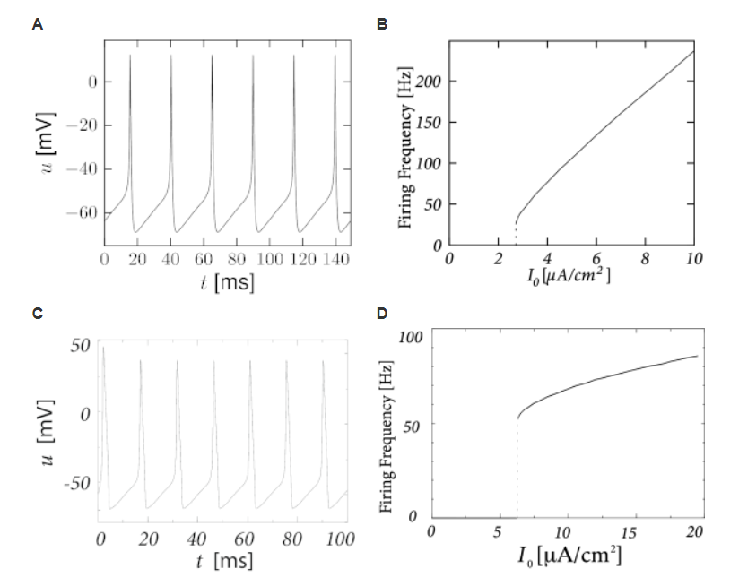
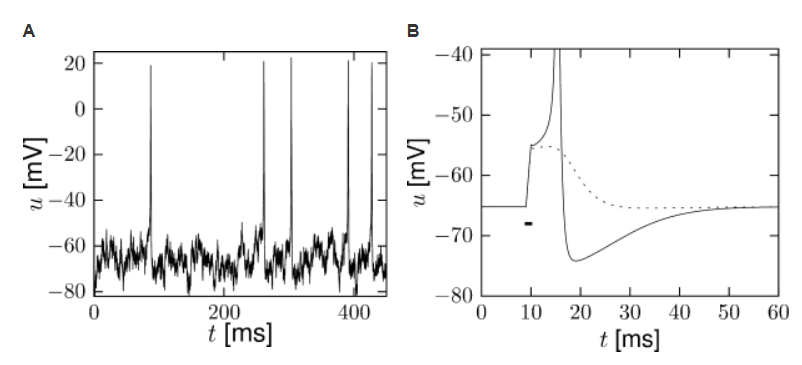
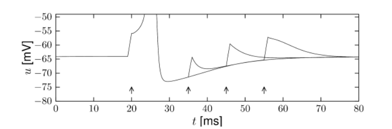

# [神经动力学-P1]第2章 离子通道和HH模型

从生物物理的角度，动作电位是通过细胞膜的离子通道的电流产生的。在对乌贼巨大轴突的一系列广泛实验中，Hodgkin和Huxley成功的测量了这些电流，尝试用微分方程描述动力学变化。在1952年发表的文章里用展示了与简洁的数学理论结合的漂亮实验被认为是开创性的工作，最终导致Hodgkin和Huxley在1963年获得诺贝尔奖。在这个章节回顾了HH模型，并通过几个例子说明一些例子。

HHM原始模型只描述了三种离子通道。最后，我们会在章节2.3中看到，该模型可以被扩展到其它类型的离子通道。HH方程是详细神经元模型的基础，能够解释不同类型的突触和单个神经元的空间几何。树突的突触动力学和空间结构是第3章的主题。HHM也是第4章中推导简单神经元模型的出发点，将作为贯穿本书第二部分中关于GLM(Generalized Integrate-and-Fire Model)讨论的参考。

在我们开始讨论HH方程之前，我们需要给出一些离子通道平衡电位(equilibrium potential)补充知识。

## 2.1 平衡电位

神经元像其它细胞一样被细胞膜包裹着，将细胞内质与细胞外空间分开。细胞内离子的密度与周围液体的密度是由差异的。浓度的差异产生电位，这在神经动力学中扮演很重要的角色。在该节中，我们想提供一些背景知识，给出平衡电位的直观解释。

### 2.1.1 Nernst电位

从神经动力学理论，我们知道，分子处于能量$E$状态的概率与玻尔兹(Boltzmann)曼因子成正比$p(E) \propto \exp(-E/kT)$，其中$k$是玻尔兹曼常数，$T$是温度。让我们考虑静电场中电荷为$q$的正离子。在位置$x$的能量是$E(x)=qu(x)$，其中$u(x)$是在$x$位置的电位。因此，在$x$周围区域找到一个离子的概率正比于$\exp[-qu(x)/kT]$。因为离子的数量很大，我们可以用离子密度来解释这个密度。对于正电荷$q(q>0)$的离子，在低电位$u$处的离子密度要更高。让我们写出在$x$处离子密度$n(x)$。在$x_1$点和$x_2$点的密度关系可以表示为
$$
\frac{n(x_1)}{n(x_2)} = \exp[-\frac{qu(x_1)-qu(x_2)}{kT}] \tag{2.1}
$$
因此，电位差$\Delta u = u(x_1)-u(x_2)$产生离子密度的差异，如图2.1所示。

图2.1：A.平衡电位，电场中正离子的分布，使高能量离子少，低能离子多。因此，电压差产生密度梯度。B.相似地， 离子浓度的差异产生电位差。在神经元内密度$n_2$与周围密度$n_1$是不同的。由此产生的电位称为Nernst电位。实线表示细胞膜。离子可以通过缝隙穿过。

因为这是关于平衡电位的介绍，反之也应该是对的。离子密度的差异产生差异电位$\Delta u$。我们考虑离子的两个密度分别为$n_1$和$n_2$的区域，如图2.1B所示。解方程(2.1)，密度差产生的电位差表示为
$$
\Delta u = \frac{kT}{q}\ln\frac{n_2}{n_1} \tag{2.2}
$$
称为Nernst电位。

### 2.1.2 反转电位

细胞膜由一层薄的双分子层脂质组成，是近似完美的电绝缘体。但是，嵌入在细胞膜内的特定神经元作为离子门(ion gates)。第一种类型的门是离子泵(ion pumps)，第二种是离子通道(ion channels)。离子泵主动传输离子从一侧到另外一侧。结果，细胞内离子浓度不同于周围浓度。举个例子，人类神经元内钠离子浓度($\approx10\mathrm{mM}$)比细胞外液浓度($\approx145\mathrm{mM}$)低。另一方面，胞内钾离子浓度($\approx140\mathrm{mM}$)别外液($\approx5\mathrm{mM}$)高。Hodgkin和Huxley所研究的乌贼的巨大轴突，其数量略有不同，但基本观点是相同的: 细胞外的钠比细胞内的多，而钾的情况则相反。

让我们先关注下钾离子。在平衡状态，密度差产生大约为$+67\mathrm{mV}$的Nernst电位$E_{Na}$。也就是，在平衡状态，细胞内相对于细胞周围有正向电压。细胞内和周围液体通过离子通道连接，其中$\mathrm{Na}^+$可以从一侧通过到达另一侧。如果电压差$\Delta u$比Nernst电位$E_{Na}$要小，更多的$\mathrm{Na}^+$会流入细胞，进而降低密度差。如果电位差大于Nernst 电位，离子会流出细胞。因此电流的方向是反向的，当$\Delta u$通过$E_{Na}$时。因为这个原因，$E_{Na}$称为方向电位(Reversal potential)。

#### 例子：钾(Potassium)的反转电位

像上面提到的，钾离子浓度在细胞内($\approx140\mathrm{mM}$)比细胞外液($\approx5\mathrm{mM}$)高。钾离子有正电荷$q=1.6\times10^{-19}C$。代入方程(2.2)的Nernst方程，其中玻尔兹曼函数为$k=1.4\times10^{-23}$，在室温条件下，产生$E_K\approx -83 \mathrm{mV}$。钾离子的反转电位时负的。

#### 例子： 静息电位

到目前为止，我们已经考虑钠离子和钾离子。在真实的细胞中，这些和其它离子类型同时存在，并形成跨膜电压。通过实验发现，膜静息电位$u_{rest}=\mathrm{-65mV}$。因为$E_K<u_{rest}<E_{Na}$，钾离子在静息电位时候流出细胞，钠离子流入到细胞。在稳定的状态，活跃的离子泵平衡这些流动和转移，就像其它例子经过通道穿过细胞膜一样。$u_{rest}$的值由离子通过通道的流动(膜的渗透性)和主动离子输运(离子泵维持浓度差的效率)之间的动力平衡决定的，

## 2.2 Hodgkin-Huxley Model

Hodgkin和Huxley 对乌贼的巨大轴突进行了实验，发现了三种不同类型的离子流，即，钠离子，钾离子和主要是氯离子的泄漏电流。电压相关的离子通道，一个是钠离子，另一个是钾离子，控制这些离子流过细胞膜。泄露电流考虑其它不需要清楚解释的通道类型。

### 2.2.1模型的定义

图2.2：HH模型展示图

HH模型可以可以在图2.2中理解。半透性膜将细胞内和细胞外液体分开，并当作电容器。如果输入电力$I(t)$被注入到细胞内，这可能给电容增加额外的电荷，或者从细胞膜通道泄露。每个通道类型在图2.2中表示为电阻。非特定通道由一个泄露电阻$R$，钠离子通道电阻$R_{Na}$和钾离子通道电阻$R_K$。穿过电阻的对角箭头表示电阻的值不是固定的，而是随着离子通道是否开放或者关闭二变化的。因为通过细胞膜的活跃离子传输，细胞内离子浓度与细胞外液有差异。由离子浓度差产生的Nernst电位在图2.2中表示为一个电源。因为Nernst电位对不同离子类型是不同的，因此对钠离子，钾离子和非特异性第三个通道分别由电源电压$E_{Na},E_K$和$E_L$。

现在让我们将上面的电路翻译成数学方程。薄膜上的电荷守恒可以表示为输入电流$I(t)$可以分成给电容$C$充电的电容电流$I_C$和其它通过离子通道的元素$I_k$，因此
$$
I(t)=I_C(t)+\sum_kI_k(t) \tag{2.3}
$$
其中，求和包括了所有离子通道。在标准HH模型中，这里只有三种类型的通道：钠离子通道(Na)，钾离子通道(K)和非特异性泄露通道(R)（如图2.2所示）从电容的定义$C=q/u$，其中$q$是电荷，$u$是跨电容电压，我们发现充电电流$I_C=C\mathrm{d}u/\mathrm{d}t$。因此，从式(2.3)，
$$
C\frac{\mathrm{d}u}{\mathrm{t}}=-\sum_kI_k(t)+I(t) \tag{2.4}
$$
在生物方面，$u$是跨膜电压，$\sum_kI_k$是通过细胞膜的离子通道电流之和。

图2.3：HH模型。A. HH模型中三个变量$m,n,h$的平衡函数。B. 与电压相关时间常数。静息电位是$u=-65mV$(箭头),参数如表2.1所示。

如上述所示，HH模型描述了三种类型的通道。所有通道可以被电阻或者等效地电导代替。泄露通道可以被电压独立的电导$g_L=1/R$描述。因为$u$是跨膜的总电压，$E_L$是电源电压，图2.2上泄露电阻的电压为$u-E_L$。使用欧姆定律，我们可以得到泄露电流为$I_L=g_L(u-E_L)$。

其它离子通道的数学形式 除了它们的电导与电压和时间有关之外，它们是类似的。如果所有通道都是打开的，他们分别以最大的电导$g_{Na}$或$g_K$传输电流。正常情况下，有些通道是被锁住的。Hodgkin和Huxley的突破是他们成功 测量一个通道的有效电阻如何随时间和电压的变化。此外，他们提出了观察现象的数学描述形式。特别地，他们加入了额外的门变量$m,n$和$h$来模拟一个通道在给定时间的开放概率。$m$和$h$的组合活动控制$Na^+$通道，$K+$通道受到$n$的控制。例如，钠离子通道有效电导可以表述为$1/R_{Na}=g_{Na}m^3h$，其中$m$描述通道激活(打开)，$h$描述通道抑制(关闭)。钾离子的电导可以描述为$1/R_K=g_Kn^4$，其中$n$描述通道激活。

总之，Hodgkin和Huxley 将式(2.4)右侧的三种离子流表示为 
$$
\sum_kI_k=g_{Na}m^3h(u-E_{Na})+g_Kn^4(u-E_K)+g_L(u-E_L) \tag{2.5}
$$
参数$E_{Na}，E_K$和$E_L$是反转电位。

表2.1：适用于皮层锥体神经元的HH方程的参数。  Huguenard等人的实验用Zach Mainen拟合$n$和$m$的参数，Hamill等人的实验用Richard Naud拟合h的参数。电压测量单位是mV，膜电容是$C=1\mu F/cm^2$。

三个门变量$m,n$和$h$根据下面微分方程变化，
$$
\dot{x}=-\frac{1}{\tau_x(u)}[x-x_0(u)] \tag{2.6}
$$
其中，$x$表示为$m,n$或$h$。式(2.6)的解释很简单。对于给定电压$u$，变量$x$以时间常数为$\tau_x(u)$逼近目标值$x_0(u)$。 时间常数和渐近值的电压依赖性如图2.3所示。图2.3中函数的形式和式(2.5)中最大电导和反转电位由Hodgkin和Huxley的经验测量推到得到。

#### 例子：电压阶跃

实验学家可以通过输入适当的电流到细胞来保持跨膜电压稳定在理想值。假设实验学家在$t<t_0$时刻保持细胞在静息电位$u_0=-65mV$，在$t=t_0$切换电压到新值$u_1$。结合式(2.6)中的微分方程，在$t>t_0$时，动力学为
$$
\begin{align}
m(t)&=m_0(u_1)+[m_0(u_0)-m_0(u_1)]\exp[-\frac{t-t_0}{\tau_m(u_1)}]\\
h(t)&=h_0(u_1)+[h_0(u_0)-h_0(u_1)]\exp[-\frac{t-t_0}{\tau_h(u_1)}]
\end{align} 
\tag{2.7}
$$
基于模型给出的$m_0(u),h_0(u),\tau_m(u),\tau_h(u)$，我们可以预测在$t>t_0$时由$t_0$时刻电压阶跃产生的钠离子电流为$I_{Na}(t)=g_{Na}[m^3(t)]h(t)(u_1-E_{Na})$。

相似的，由电压阶跃产生的钾离子电流为$I_K(t)=g_K[n^4(t)](u_1-E_k)$
$$
n(t)=n_0(u_1)+[n_0(u_0)-n_0(u_1)]\exp[-\frac{t-t_0}{\tau(u_1)} \tag{2.8}
$$
Hodgkin和Huxley使用式(2.7)和式(2.8)反过来计算。在 用合适的药物关闭钠离子通道，他们应用电压阶跃测量钾离子电流时间序列信号。 将记录的电流除以驱动电势$(u_1-E_K)$产生时间相关电导$g_K[n^4(t)]$，如图2.4所示。使用式(2.8)，Hodgkin和Huxley推导钾离子的$n_0(u_1)$和$\tau_n(u_1)$的值和四次幂$n^4(t)$ 。用不同的$u_1$值重复实验可以得到$n_0(u)$和$\tau_n(u)$的实验曲线。

图2.4： 原始数据和Hodgkin和Huxley拟合结果。在电压阶跃为25mV下的钾离子电导(圆)的测量时间序列和回复静息电位(右图)。基于式(2.8)的拟合(实线)。

#### 例子：激活和失活

变量$m$叫做激活变量。为了理解这个输入，我们在图2.3中标注了在神经静息电位时候$m_0(u)$的值趋近于0。因此，在静息时，钠离子电流$I_{Na}=g_{Na}m^3h(u-E_{Na})$通过通道小时。也就是说，钠离子通道关闭。

当膜电位显著增加到静息电位之上，门变量$m$增大 到新的值$m_0(u)$。只要$h$不发生变化，钠离子电流增加，门打开，因此，变量$m$激活了通道。如果，在电压回复到静息状态时，$m$逐渐下降到0，称为去激活(de-activation)。

术语失活(inactivation)变量$h$是类似的。在静息状态，$h$由大的正值。如果电压增加到$-40mV$之上时候，$h$逼近新值$h_0(u)$，这个时候接近静息状态。因此，通道的失活的时间常数是$\tau_h(u)$。如果电压变为0，$h$增加，通道尽力去失活(de-inactivation)。这听起来像是复杂的词汇，但是结果表明在区分失活通道($m$趋近于0，$h$趋近于1)和激活通道是很有用的($h$趋近于0)。

### 2.2.2 随机通道开放

在膜上离子通道的数量是有限的，单个离子通道随机的开放和关闭。因此，当实验学家记录到流过膜的电流， 他没有找到一个测量变量的平稳可靠的演变方式，而是高度震荡的电流，这个在不同实验中看起来不同(图2.5)。

HH方程用描述变量$m,h$和$n$的确定性方程描述离子通道的打开和关闭， 对应于通过一个假设的、包含无限个通道的超大片膜的电流密度，或者对应于通过一个小片膜的电流密度，但在同一实验多次重复后的平均值(图2.5)。随机性角度可以通过增加适当的噪声到模型中。

图2.5：随机通道激活。在电压阶跃(最上一行)刺激后流过膜的电流表现出阶跃形状变化，在每个实验中都是不同的。 多次试验的平均结果是底部的轨迹 

#### 例子：时间常数，转移率(transition rates)，和通道动力学(channel kinetics)

作为式(2.6)中离子门的替代形式，每个通道类型的激活和失活动力学也可以根据电压相关的转移率$\alpha$和$\beta$来描述：
$$
\begin{align}
\dot{m} &= \alpha_m(u)(1-m)-\beta_m(u)m\\
\dot{n} &= \alpha_n(u)(1-n)-\beta_n(u)n\\
\dot{h} &= \alpha_h(u)(1-h)-\beta_h(u)h
\end{align}\tag{2.9}
$$
式(2.6)和(2.9)中的两种描述形式式等价的。渐进值$x_0(u)$和时间常数$\tau_x(u)$可以通过变换$x_0(u)=\alpha_x(u)/[\alpha_x(u)+\beta_x(u)]$和$\tau_x(u)=[\alpha_x(u)+\beta_x(u)]^{-1}$得到。不同的函数$\alpha$和$\beta$是电压$u$的经验函数，产生的曲线如图2.3所示。

方程(2.9)是典型的用在化学中去描述速率常数$\alpha$和$\beta$为激活过程的随机性方程。我们可以解释这个过程为分子在两个电压相关转移率状态下的切换。例如，激活变量$n$可以被解释为找到单个钾离子通道开放的概率。因此，在$K$钾离子通道中，近似$k\approx(1-n)K$通道应该是关闭的。我们解释$\alpha_n(u)\Delta $为在极短时间$\Delta t$内关闭的通道切换到开放的概率。

### 2.2.3 动力学

图2.6. A.动作电位。HH模型在$t=1ms$和$t=2ms$之间被很短但是很强的脉冲电流刺激。在$t>2ms$的膜电位的时间序列展示了动作电位(正峰值)，紧接着是相对不应期，这时电位在静息电位以下（虚线)。B. 门变量$m,h,n$的动力学模型阐述了动作电位是如何被钠离子和钾离子通道调节的。C.依赖于变量$m$和$h$的钠离子电流$I_{Na}$由在动作电位上升期有陡峭的峰值。钾离子电流$I_K$受到变量$n$的控制，从下降期开始打开。

 在本节中，我们研究不同类型输入的HH模型的动力学。依次考虑脉冲输入、常数输入、阶跃电流输入和时变输入。选择这些输入场景是为了对HH模型的动力学特性提供一个直观的理解。

HH模型的最重要性质是能够产生动作电位。在图2.6中， 在$t=1ms$时，一个持续1ms的短电流脉冲启动动作电位。买上有将近为100mV的幅度和约为2.5ms最大半周期。在脉冲之后，膜电位下降到静息电位之下，缓慢的恢复到静息电位。

#### 脉冲产生时离子通道动力学

为了去理解差生动作电位下的生物物理机制，我们返回到图2.3A。我们发现$m_0$和$n_0$随着$u$增加，但是$h_0$下降。因此，如果一些外部输入导致膜电位上升，钠离子通道电导因为$m$增大而增大。结果，正钠离子流入细胞，产生膜电位发生更大的变化。如果正返回足够大，动作电位被激发。当膜电位接近反转电位$E_{Na}$，爆炸式增长到自然的一半。

在大的$u$值时候，钠离子电导由于门变量$h$缓慢关闭。如图2.3B中所示，时间常数$\tau_h$总是别$\tau_m$大。因此，让通道失活的变量$h$反应比电压控制通道打开的上升变量$m$慢的多。相似的缓慢时间尺度，如图2.6B中的钾离子电流。 因为它是向外的电流，它降低电位。 钠电流和钾电流的总体效应是短动作电位，然后是负超调。 负超调，称为超极化后尖峰电位，是由于由h变量引起的钠通道的缓慢失活引起的。 

图2.7: A. 在恒定输入电流$I_0$下HH模型中的脉冲产生。B. 增益函数。平均发放频率$v$画在图上。HH模型的增益函数为II型，因为它出现了跳变。 C. 和A一样，但是对于Hodgkin和Huxley发现的用来描述乌贼巨大轴突的离子流的原始参数。  D. 模型的增益函数。 

#### 例子：平均放电频率和增益函数

HH方程(2.4-2.10)可能可以用恒等输入$I(t)=I_0,t>0$看来研究($t<0$电流为0)。如果$I_0$的值比关键值$I_\theta\approx2.7\mu A/cm^2$大，我们观察到常见的脉冲(图2.7A)。我们可以定义发放频率$v=1/T$,其中$T$是脉冲间隔。

放电频率是恒等输入$I_0$的函数，常称为频率电流关系，定义增益函数如图2.7B所示。 参数如表2.1所示，增益函数表现出在$I_0$时刻阶跃。增益函数具有不连续性称为类型II。 如果我们将失活变量h的曲线移至更大的正电压，并保持其它参数不变，修改后的HH模型显示出平滑的增益函数。如果他们有连续的频率电流关系，神经元模型，货更广泛的可兴奋膜被称为I型 。 I型和II型兴奋性的区别可以追溯到 Hodgkin。

#### 例子： 时间相关刺激

为了研究更多真实输入情况，我们通过下面步骤用时间相关输入电流$I(t)$刺激HH模型。每隔2ms，从0均值，方差为$\sigma=34\mu A/cm^2$的高斯分布中取一个值。为了得到连续的输入电流，线性插值用来模拟两个数值之间的值。 由此产生的随时间变化的输入电流被应用到HH模型。电流的反应的电压轨迹如图2.8A所示。 注意动作电位发生的时间间隔不规则。 

图2.8： A. 时间相关的输入电流驱动的HH模型的脉冲序列。动作电位不规则地发生。图中显示了电压u作为时间的函数。B. 阈值效应。施加1ms的短电流脉冲，使膜电位偏移几毫伏(虚线)。电流脉冲强度的轻微增加导致产生振幅高于静止(超出范围)约100mV的动作电位(实线)。 

#### 例子: 发放阈值

在图2.8B中， 动作电位(实线)由持续1ms的短电流脉冲启动。 如果刺激电流脉冲的振幅降低到某个临界值以下，膜电位(虚线)返回到剩余值，而没有一个大的尖状偏移。 因此，我们有一个阈值类型的行为。 

如果我们增加电流的幅度2倍，但是减小电流脉冲间隔到0.5ms，那么电流脉冲传递与之前相同的电子数量，反应曲线如图2.8B所示，将会看起来很相似。因此，脉冲启动的阈值不是有输入电流脉冲的幅度定义的。与之相反，是由脉冲或者脉冲之后膜电压的电子决定的，这个导致了动作电位是否会发生。但是，放电的电压阈值概念是非常有效的量化方式去理解对电流脉冲的脉冲启动的， 它本身并不足以捕捉HH模型的动力学;参见本章和后面两章的讨论。 

#### 例子：不应期

为了研究神经不应期，我们用一个能够激活脉冲的电流脉冲模拟HH模型。第二个与有与第一个脉冲相同振幅的电流用来探测神经元在动作电位之后的超极化阶段的反应。如果第二个刺激不能够激活另外一个动作电位，我们就有明显的神经元不应期。这个模拟如图2.9所示， 如果第二个刺激在第一个刺激后的40毫秒内被给予，那么第二个脉冲就不会被发出。 当然， 如果使用明显更强的刺激脉冲 ， 它有可能在较短的间隔后触发第二次脉冲， 

如果我们更仔细的观察图2.9中的轨迹，我们可以看到神经元不应期表现为两种不同的形式 。首先，由于在动作电位之后的超极化脉冲， 电压很低。因此，需要更多的刺激才能打到发放的阈值。第二，因为大量的通道在脉冲之后立即打开， 与静止状态相比，膜的电阻降低了。因此，刺激电流脉冲的去极化作用立即消散的速度比10毫秒之后的刺激更快。不应期有效的描述在第6章的简单神经元模型中扮演着重要的角色。

图2.9；HH模型的不应期。在$t=20$ms，模型被短电流脉冲(左箭头)作用来激活动作电位。第二个有相同幅度的脉冲电流作用在$t=35,45,55$ms(紧接着的箭头)不能够激活第二个动作电位

#### 例子： 阻尼振荡和瞬态脉冲 

当用小阶跃电流刺激，有表2.1中参数的HH模型在刺激作用之后表现出最大约20ms的阻尼振荡，如图2.10所示。如果阶跃大小最够大，但是不足以导致持续放电，一个脉冲会产生。注意在图2.10中， 输入电流以200ms返回到100毫秒之前的相同值。  当神经元在第一步之后保持静止时，它会在第二次触发一个短暂的峰值，不是因为总输入更强，而是因为这一步是从一个强负值开始的。 

 由从一个强负值开始，然后又切换回零的阶跃电流引发的脉冲被称为反弹脉冲(rebound spike)。换句话说，一个反弹脉冲是由抑制释放引发的。例如，具有乌贼巨大轴突原始参数的HH模型在长时间的负输入电流停止时显示出反弹尖峰;然而，本书中采用的带有一组参数的模型却不能。 

图2.10中瞬态脉冲(transient spike)出现在起始之后的20ms左右。瞬态脉冲的简单解释就是膜电位的峰值在阶跃到达电压阈值之后震荡，因此一个动作电位被激活。如图2.10所示的瞬态脉冲下的确存在阈下振荡。

阻尼震荡(Damped Oscillations) 是钠电流阈下失活的结果。 静止时钠电流未被激活($m\approx0$)，只有部分失活($h\approx0.6$)。  对阶跃刺激做出反应,  膜电位增加，轻微激活和缓慢地去失活钠通道。 当输入不够强，动作电位不能启动时，$I_{Na}$的去失活降低驱动的效率，导致膜电位变化， 然后系统松弛到平衡状态。另一方面，如果电流强大到足以发放一个脉冲，平衡可能只能在脉冲之后到达， 一步增加的阶跃电流驱动持续放电(如图2.10所示)

## 2.3 离子通道动物园

## 2.4 总结

。

