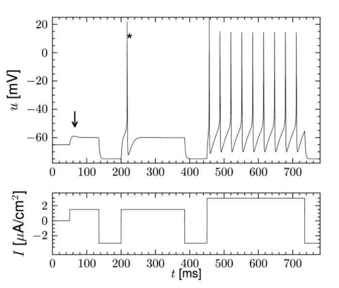
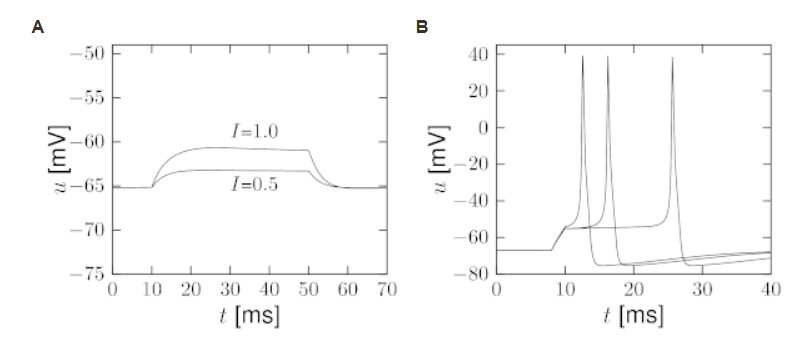
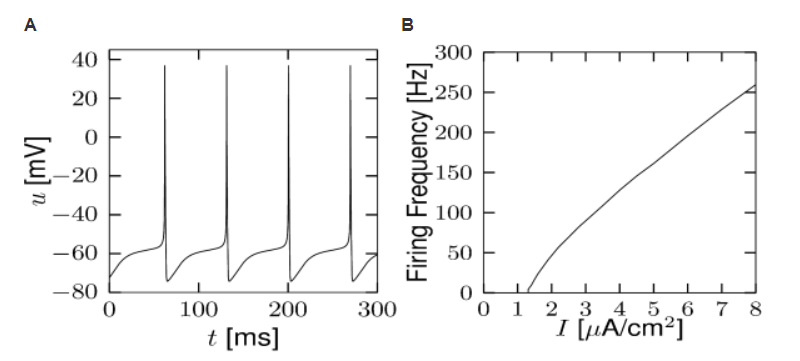
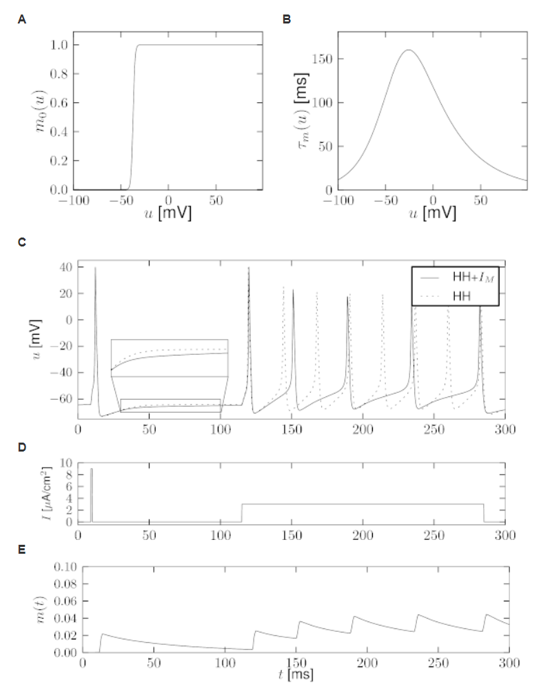
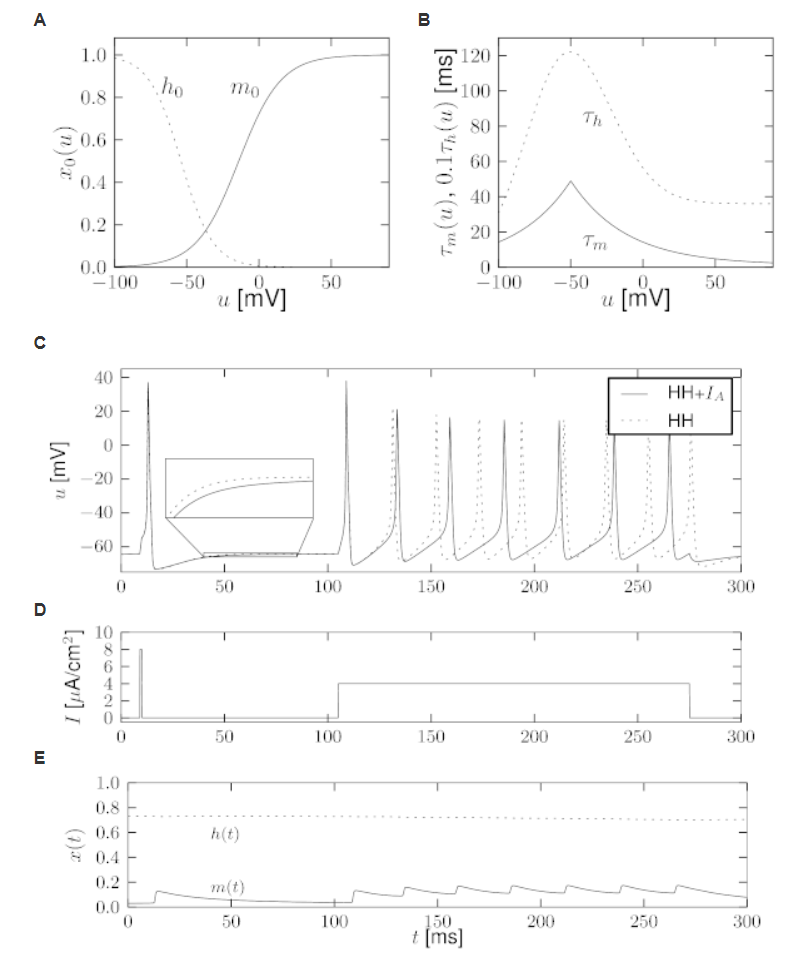
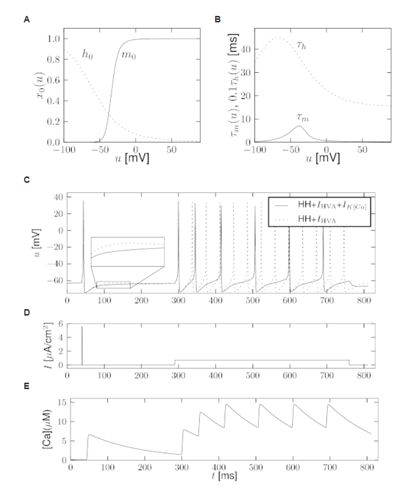
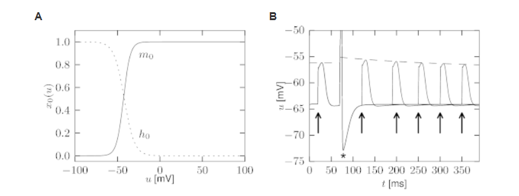
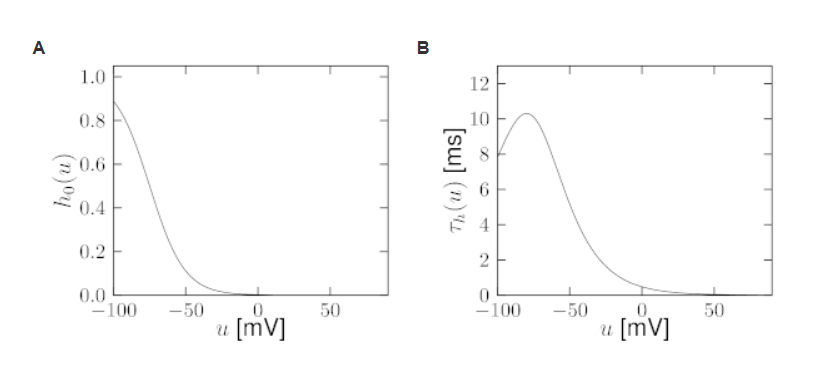
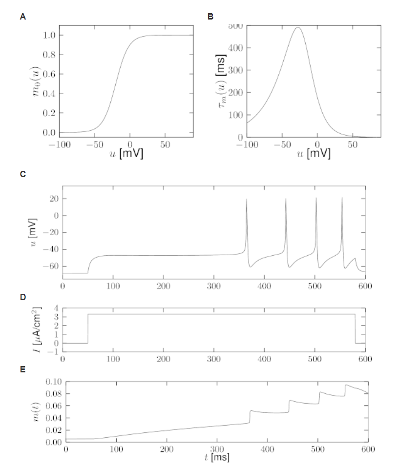
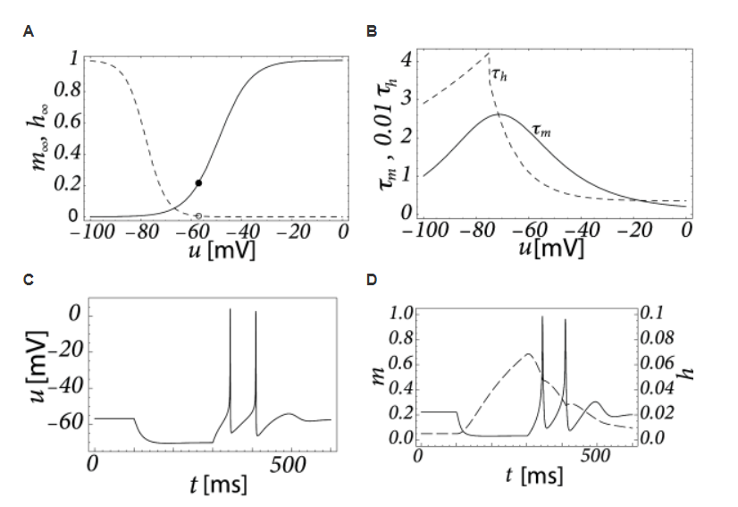

# [神经动力学-P1]第2章 离子通道和HH模型

从生物物理的角度，动作电位是通过细胞膜的离子通道的电流产生的。在对乌贼巨大轴突的一系列广泛实验中，Hodgkin和Huxley成功的测量了这些电流，尝试用微分方程描述动力学变化。在1952年发表的文章里用展示了与简洁的数学理论结合的漂亮实验被认为是开创性的工作，最终导致Hodgkin和Huxley在1963年获得诺贝尔奖。在这个章节回顾了HH模型，并通过几个例子说明一些例子。

HHM原始模型只描述了三种离子通道。最后，我们会在章节2.3中看到，该模型可以被扩展到其它类型的离子通道。HH方程是详细神经元模型的基础，能够解释不同类型的突触和单个神经元的空间几何。树突的突触动力学和空间结构是第3章的主题。HHM也是第4章中推导简单神经元模型的出发点，将作为贯穿本书第二部分中关于GLM(Generalized Integrate-and-Fire Model)讨论的参考。

在我们开始讨论HH方程之前，我们需要给出一些离子通道平衡电位(equilibrium potential)补充知识。

## 2.1 平衡电位

神经元像其它细胞一样被细胞膜包裹着，将细胞内质与细胞外空间分开。细胞内离子的密度与周围液体的密度是由差异的。浓度的差异产生电位，这在神经动力学中扮演很重要的角色。在该节中，我们想提供一些背景知识，给出平衡电位的直观解释。

### 2.1.1 Nernst电位

从神经动力学理论，我们知道，分子处于能量$E$状态的概率与玻尔兹(Boltzmann)曼因子成正比$p(E) \propto \exp(-E/kT)$，其中$k$是玻尔兹曼常数，$T$是温度。让我们考虑静电场中电荷为$q$的正离子。在位置$x$的能量是$E(x)=qu(x)$，其中$u(x)$是在$x$位置的电位。因此，在$x$周围区域找到一个离子的概率正比于$\exp[-qu(x)/kT]$。因为离子的数量很大，我们可以用离子密度来解释这个密度。对于正电荷$q(q>0)$的离子，在低电位$u$处的离子密度要更高。让我们写出在$x$处离子密度$n(x)$。在$x_1$点和$x_2$点的密度关系可以表示为
$$
\frac{n(x_1)}{n(x_2)} = \exp[-\frac{qu(x_1)-qu(x_2)}{kT}] \tag{2.1}
$$
因此，电位差$\Delta u = u(x_1)-u(x_2)$产生离子密度的差异，如图2.1所示。

图2.1：A.平衡电位，电场中正离子的分布，使高能量离子少，低能离子多。因此，电压差产生密度梯度。B.相似地， 离子浓度的差异产生电位差。在神经元内密度$n_2$与周围密度$n_1$是不同的。由此产生的电位称为Nernst电位。实线表示细胞膜。离子可以通过缝隙穿过。

因为这是关于平衡电位的介绍，反之也应该是对的。离子密度的差异产生差异电位$\Delta u$。我们考虑离子的两个密度分别为$n_1$和$n_2$的区域，如图2.1B所示。解方程(2.1)，密度差产生的电位差表示为
$$
\Delta u = \frac{kT}{q}\ln\frac{n_2}{n_1} \tag{2.2}
$$
称为Nernst电位。

### 2.1.2 反转电位

细胞膜由一层薄的双分子层脂质组成，是近似完美的电绝缘体。但是，嵌入在细胞膜内的特定神经元作为离子门(ion gates)。第一种类型的门是离子泵(ion pumps)，第二种是离子通道(ion channels)。离子泵主动传输离子从一侧到另外一侧。结果，细胞内离子浓度不同于周围浓度。举个例子，人类神经元内钠离子浓度($\approx10\mathrm{mM}$)比细胞外液浓度($\approx145\mathrm{mM}$)低。另一方面，胞内钾离子浓度($\approx140\mathrm{mM}$)别外液($\approx5\mathrm{mM}$)高。Hodgkin和Huxley所研究的乌贼的巨大轴突，其数量略有不同，但基本观点是相同的: 细胞外的钠比细胞内的多，而钾的情况则相反。

让我们先关注下钾离子。在平衡状态，密度差产生大约为$+67\mathrm{mV}$的Nernst电位$E_{Na}$。也就是，在平衡状态，细胞内相对于细胞周围有正向电压。细胞内和周围液体通过离子通道连接，其中$\mathrm{Na}^+$可以从一侧通过到达另一侧。如果电压差$\Delta u$比Nernst电位$E_{Na}$要小，更多的$\mathrm{Na}^+$会流入细胞，进而降低密度差。如果电位差大于Nernst 电位，离子会流出细胞。因此电流的方向是反向的，当$\Delta u$通过$E_{Na}$时。因为这个原因，$E_{Na}$称为方向电位(Reversal potential)。

#### 例子：钾(Potassium)的反转电位

像上面提到的，钾离子浓度在细胞内($\approx140\mathrm{mM}$)比细胞外液($\approx5\mathrm{mM}$)高。钾离子有正电荷$q=1.6\times10^{-19}C$。代入方程(2.2)的Nernst方程，其中玻尔兹曼函数为$k=1.4\times10^{-23}$，在室温条件下，产生$E_K\approx -83 \mathrm{mV}$。钾离子的反转电位时负的。

#### 例子： 静息电位

到目前为止，我们已经考虑钠离子和钾离子。在真实的细胞中，这些和其它离子类型同时存在，并形成跨膜电压。通过实验发现，膜静息电位$u_{rest}=\mathrm{-65mV}$。因为$E_K<u_{rest}<E_{Na}$，钾离子在静息电位时候流出细胞，钠离子流入到细胞。在稳定的状态，活跃的离子泵平衡这些流动和转移，就像其它例子经过通道穿过细胞膜一样。$u_{rest}$的值由离子通过通道的流动(膜的渗透性)和主动离子输运(离子泵维持浓度差的效率)之间的动力平衡决定的，

## 2.2 Hodgkin-Huxley Model

Hodgkin和Huxley 对乌贼的巨大轴突进行了实验，发现了三种不同类型的离子流，即，钠离子，钾离子和主要是氯离子的泄漏电流。电压相关的离子通道，一个是钠离子，另一个是钾离子，控制这些离子流过细胞膜。泄露电流考虑其它不需要清楚解释的通道类型。

### 2.2.1模型的定义

图2.2：HH模型展示图

HH模型可以可以在图2.2中理解。半透性膜将细胞内和细胞外液体分开，并当作电容器。如果输入电力$I(t)$被注入到细胞内，这可能给电容增加额外的电荷，或者从细胞膜通道泄露。每个通道类型在图2.2中表示为电阻。非特定通道由一个泄露电阻$R$，钠离子通道电阻$R_{Na}$和钾离子通道电阻$R_K$。穿过电阻的对角箭头表示电阻的值不是固定的，而是随着离子通道是否开放或者关闭二变化的。因为通过细胞膜的活跃离子传输，细胞内离子浓度与细胞外液有差异。由离子浓度差产生的Nernst电位在图2.2中表示为一个电源。因为Nernst电位对不同离子类型是不同的，因此对钠离子，钾离子和非特异性第三个通道分别由电源电压$E_{Na},E_K$和$E_L$。

现在让我们将上面的电路翻译成数学方程。薄膜上的电荷守恒可以表示为输入电流$I(t)$可以分成给电容$C$充电的电容电流$I_C$和其它通过离子通道的元素$I_k$，因此
$$
I(t)=I_C(t)+\sum_kI_k(t) \tag{2.3}
$$
其中，求和包括了所有离子通道。在标准HH模型中，这里只有三种类型的通道：钠离子通道(Na)，钾离子通道(K)和非特异性泄露通道(R)（如图2.2所示）从电容的定义$C=q/u$，其中$q$是电荷，$u$是跨电容电压，我们发现充电电流$I_C=C\mathrm{d}u/\mathrm{d}t$。因此，从式(2.3)，
$$
C\frac{\mathrm{d}u}{\mathrm{t}}=-\sum_kI_k(t)+I(t) \tag{2.4}
$$
在生物方面，$u$是跨膜电压，$\sum_kI_k$是通过细胞膜的离子通道电流之和。

图2.3：HH模型。A. HH模型中三个变量$m,n,h$的平衡函数。B. 与电压相关时间常数。静息电位是$u=-65mV$(箭头),参数如表2.1所示。

如上述所示，HH模型描述了三种类型的通道。所有通道可以被电阻或者等效地电导代替。泄露通道可以被电压独立的电导$g_L=1/R$描述。因为$u$是跨膜的总电压，$E_L$是电源电压，图2.2上泄露电阻的电压为$u-E_L$。使用欧姆定律，我们可以得到泄露电流为$I_L=g_L(u-E_L)$。

其它离子通道的数学形式 除了它们的电导与电压和时间有关之外，它们是类似的。如果所有通道都是打开的，他们分别以最大的电导$g_{Na}$或$g_K$传输电流。正常情况下，有些通道是被锁住的。Hodgkin和Huxley的突破是他们成功 测量一个通道的有效电阻如何随时间和电压的变化。此外，他们提出了观察现象的数学描述形式。特别地，他们加入了额外的门变量$m,n$和$h$来模拟一个通道在给定时间的开放概率。$m$和$h$的组合活动控制$Na^+$通道，$K+$通道受到$n$的控制。例如，钠离子通道有效电导可以表述为$1/R_{Na}=g_{Na}m^3h$，其中$m$描述通道激活(打开)，$h$描述通道抑制(关闭)。钾离子的电导可以描述为$1/R_K=g_Kn^4$，其中$n$描述通道激活。

总之，Hodgkin和Huxley 将式(2.4)右侧的三种离子流表示为 
$$
\sum_kI_k=g_{Na}m^3h(u-E_{Na})+g_Kn^4(u-E_K)+g_L(u-E_L) \tag{2.5}
$$
参数$E_{Na}，E_K$和$E_L$是反转电位。

表2.1：适用于皮层锥体神经元的HH方程的参数。  Huguenard等人的实验用Zach Mainen拟合$n$和$m$的参数，Hamill等人的实验用Richard Naud拟合h的参数。电压测量单位是mV，膜电容是$C=1\mu F/cm^2$。

三个门变量$m,n$和$h$根据下面微分方程变化，
$$
\dot{x}=-\frac{1}{\tau_x(u)}[x-x_0(u)] \tag{2.6}
$$
其中，$x$表示为$m,n$或$h$。式(2.6)的解释很简单。对于给定电压$u$，变量$x$以时间常数为$\tau_x(u)$逼近目标值$x_0(u)$。 时间常数和渐近值的电压依赖性如图2.3所示。图2.3中函数的形式和式(2.5)中最大电导和反转电位由Hodgkin和Huxley的经验测量推到得到。

#### 例子：电压阶跃

实验学家可以通过输入适当的电流到细胞来保持跨膜电压稳定在理想值。假设实验学家在$t<t_0$时刻保持细胞在静息电位$u_0=-65mV$，在$t=t_0$切换电压到新值$u_1$。结合式(2.6)中的微分方程，在$t>t_0$时，动力学为
$$
\begin{align}
m(t)&=m_0(u_1)+[m_0(u_0)-m_0(u_1)]\exp[-\frac{t-t_0}{\tau_m(u_1)}]\\
h(t)&=h_0(u_1)+[h_0(u_0)-h_0(u_1)]\exp[-\frac{t-t_0}{\tau_h(u_1)}]
\end{align} 
\tag{2.7}
$$
基于模型给出的$m_0(u),h_0(u),\tau_m(u),\tau_h(u)$，我们可以预测在$t>t_0$时由$t_0$时刻电压阶跃产生的钠离子电流为$I_{Na}(t)=g_{Na}[m^3(t)]h(t)(u_1-E_{Na})$。

相似的，由电压阶跃产生的钾离子电流为$I_K(t)=g_K[n^4(t)](u_1-E_k)$
$$
n(t)=n_0(u_1)+[n_0(u_0)-n_0(u_1)]\exp[-\frac{t-t_0}{\tau(u_1)} \tag{2.8}
$$
Hodgkin和Huxley使用式(2.7)和式(2.8)反过来计算。在 用合适的药物关闭钠离子通道，他们应用电压阶跃测量钾离子电流时间序列信号。 将记录的电流除以驱动电势$(u_1-E_K)$产生时间相关电导$g_K[n^4(t)]$，如图2.4所示。使用式(2.8)，Hodgkin和Huxley推导钾离子的$n_0(u_1)$和$\tau_n(u_1)$的值和四次幂$n^4(t)$ 。用不同的$u_1$值重复实验可以得到$n_0(u)$和$\tau_n(u)$的实验曲线。

图2.4： 原始数据和Hodgkin和Huxley拟合结果。在电压阶跃为25mV下的钾离子电导(圆)的测量时间序列和回复静息电位(右图)。基于式(2.8)的拟合(实线)。

#### 例子：激活和失活

变量$m$叫做激活变量。为了理解这个输入，我们在图2.3中标注了在神经静息电位时候$m_0(u)$的值趋近于0。因此，在静息时，钠离子电流$I_{Na}=g_{Na}m^3h(u-E_{Na})$通过通道小时。也就是说，钠离子通道关闭。

当膜电位显著增加到静息电位之上，门变量$m$增大 到新的值$m_0(u)$。只要$h$不发生变化，钠离子电流增加，门打开，因此，变量$m$激活了通道。如果，在电压回复到静息状态时，$m$逐渐下降到0，称为去激活(de-activation)。

术语失活(inactivation)变量$h$是类似的。在静息状态，$h$由大的正值。如果电压增加到$-40mV$之上时候，$h$逼近新值$h_0(u)$，这个时候接近静息状态。因此，通道的失活的时间常数是$\tau_h(u)$。如果电压变为0，$h$增加，通道尽力去失活(de-inactivation)。这听起来像是复杂的词汇，但是结果表明在区分失活通道($m$趋近于0，$h$趋近于1)和激活通道是很有用的($h$趋近于0)。

### 2.2.2 随机通道开放

在膜上离子通道的数量是有限的，单个离子通道随机的开放和关闭。因此，当实验学家记录到流过膜的电流， 他没有找到一个测量变量的平稳可靠的演变方式，而是高度震荡的电流，这个在不同实验中看起来不同(图2.5)。

HH方程用描述变量$m,h$和$n$的确定性方程描述离子通道的打开和关闭， 对应于通过一个假设的、包含无限个通道的超大片膜的电流密度，或者对应于通过一个小片膜的电流密度，但在同一实验多次重复后的平均值(图2.5)。随机性角度可以通过增加适当的噪声到模型中。

图2.5：随机通道激活。在电压阶跃(最上一行)刺激后流过膜的电流表现出阶跃形状变化，在每个实验中都是不同的。 多次试验的平均结果是底部的轨迹 

#### 例子：时间常数，转移率(transition rates)，和通道动力学(channel kinetics)

作为式(2.6)中离子门的替代形式，每个通道类型的激活和失活动力学也可以根据电压相关的转移率$\alpha$和$\beta$来描述：
$$
\begin{align}
\dot{m} &= \alpha_m(u)(1-m)-\beta_m(u)m\\
\dot{n} &= \alpha_n(u)(1-n)-\beta_n(u)n\\
\dot{h} &= \alpha_h(u)(1-h)-\beta_h(u)h
\end{align}\tag{2.9}
$$
式(2.6)和(2.9)中的两种描述形式式等价的。渐进值$x_0(u)$和时间常数$\tau_x(u)$可以通过变换$x_0(u)=\alpha_x(u)/[\alpha_x(u)+\beta_x(u)]$和$\tau_x(u)=[\alpha_x(u)+\beta_x(u)]^{-1}$得到。不同的函数$\alpha$和$\beta$是电压$u$的经验函数，产生的曲线如图2.3所示。

方程(2.9)是典型的用在化学中去描述速率常数$\alpha$和$\beta$为激活过程的随机性方程。我们可以解释这个过程为分子在两个电压相关转移率状态下的切换。例如，激活变量$n$可以被解释为找到单个钾离子通道开放的概率。因此，在$K$钾离子通道中，近似$k\approx(1-n)K$通道应该是关闭的。我们解释$\alpha_n(u)\Delta $为在极短时间$\Delta t$内关闭的通道切换到开放的概率。

### 2.2.3 动力学

图2.6. A.动作电位。HH模型在$t=1ms$和$t=2ms$之间被很短但是很强的脉冲电流刺激。在$t>2ms$的膜电位的时间序列展示了动作电位(正峰值)，紧接着是相对不应期，这时电位在静息电位以下（虚线)。B. 门变量$m,h,n$的动力学模型阐述了动作电位是如何被钠离子和钾离子通道调节的。C.依赖于变量$m$和$h$的钠离子电流$I_{Na}$由在动作电位上升期有陡峭的峰值。钾离子电流$I_K$受到变量$n$的控制，从下降期开始打开。

 在本节中，我们研究不同类型输入的HH模型的动力学。依次考虑脉冲输入、常数输入、阶跃电流输入和时变输入。选择这些输入场景是为了对HH模型的动力学特性提供一个直观的理解。

HH模型的最重要性质是能够产生动作电位。在图2.6中， 在$t=1ms$时，一个持续1ms的短电流脉冲启动动作电位。买上有将近为100mV的幅度和约为2.5ms最大半周期。在脉冲之后，膜电位下降到静息电位之下，缓慢的恢复到静息电位。

#### 脉冲产生时离子通道动力学

为了去理解差生动作电位下的生物物理机制，我们返回到图2.3A。我们发现$m_0$和$n_0$随着$u$增加，但是$h_0$下降。因此，如果一些外部输入导致膜电位上升，钠离子通道电导因为$m$增大而增大。结果，正钠离子流入细胞，产生膜电位发生更大的变化。如果正返回足够大，动作电位被激发。当膜电位接近反转电位$E_{Na}$，爆炸式增长到自然的一半。

在大的$u$值时候，钠离子电导由于门变量$h$缓慢关闭。如图2.3B中所示，时间常数$\tau_h$总是别$\tau_m$大。因此，让通道失活的变量$h$反应比电压控制通道打开的上升变量$m$慢的多。相似的缓慢时间尺度，如图2.6B中的钾离子电流。 因为它是向外的电流，它降低电位。 钠电流和钾电流的总体效应是短动作电位，然后是负超调。 负超调，称为超极化后尖峰电位，是由于由h变量引起的钠通道的缓慢失活引起的。 

图2.7: A. 在恒定输入电流$I_0$下HH模型中的脉冲产生。B. 增益函数。平均发放频率$v$画在图上。HH模型的增益函数为II型，因为它出现了跳变。 C. 和A一样，但是对于Hodgkin和Huxley发现的用来描述乌贼巨大轴突的离子流的原始参数。  D. 模型的增益函数。 

#### 例子：平均放电频率和增益函数

HH方程(2.4-2.10)可能可以用恒等输入$I(t)=I_0,t>0$看来研究($t<0$电流为0)。如果$I_0$的值比关键值$I_\theta\approx2.7\mu A/cm^2$大，我们观察到常见的脉冲(图2.7A)。我们可以定义发放频率$v=1/T$,其中$T$是脉冲间隔。

放电频率是恒等输入$I_0$的函数，常称为频率电流关系，定义增益函数如图2.7B所示。 参数如表2.1所示，增益函数表现出在$I_0$时刻阶跃。增益函数具有不连续性称为类型II。 如果我们将失活变量h的曲线移至更大的正电压，并保持其它参数不变，修改后的HH模型显示出平滑的增益函数。如果他们有连续的频率电流关系，神经元模型，货更广泛的可兴奋膜被称为I型 。 I型和II型兴奋性的区别可以追溯到 Hodgkin。

#### 例子： 时间相关刺激

为了研究更多真实输入情况，我们通过下面步骤用时间相关输入电流$I(t)$刺激HH模型。每隔2ms，从0均值，方差为$\sigma=34\mu A/cm^2$的高斯分布中取一个值。为了得到连续的输入电流，线性插值用来模拟两个数值之间的值。 由此产生的随时间变化的输入电流被应用到HH模型。电流的反应的电压轨迹如图2.8A所示。 注意动作电位发生的时间间隔不规则。 

图2.8： A. 时间相关的输入电流驱动的HH模型的脉冲序列。动作电位不规则地发生。图中显示了电压u作为时间的函数。B. 阈值效应。施加1ms的短电流脉冲，使膜电位偏移几毫伏(虚线)。电流脉冲强度的轻微增加导致产生振幅高于静止(超出范围)约100mV的动作电位(实线)。 

#### 例子: 发放阈值

在图2.8B中， 动作电位(实线)由持续1ms的短电流脉冲启动。 如果刺激电流脉冲的振幅降低到某个临界值以下，膜电位(虚线)返回到剩余值，而没有一个大的尖状偏移。 因此，我们有一个阈值类型的行为。 

如果我们增加电流的幅度2倍，但是减小电流脉冲间隔到0.5ms，那么电流脉冲传递与之前相同的电子数量，反应曲线如图2.8B所示，将会看起来很相似。因此，脉冲启动的阈值不是有输入电流脉冲的幅度定义的。与之相反，是由脉冲或者脉冲之后膜电压的电子决定的，这个导致了动作电位是否会发生。但是，放电的电压阈值概念是非常有效的量化方式去理解对电流脉冲的脉冲启动的， 它本身并不足以捕捉HH模型的动力学;参见本章和后面两章的讨论。 

#### 例子：不应期

为了研究神经不应期，我们用一个能够激活脉冲的电流脉冲模拟HH模型。第二个与有与第一个脉冲相同振幅的电流用来探测神经元在动作电位之后的超极化阶段的反应。如果第二个刺激不能够激活另外一个动作电位，我们就有明显的神经元不应期。这个模拟如图2.9所示， 如果第二个刺激在第一个刺激后的40毫秒内被给予，那么第二个脉冲就不会被发出。 当然， 如果使用明显更强的刺激脉冲 ， 它有可能在较短的间隔后触发第二次脉冲， 

如果我们更仔细的观察图2.9中的轨迹，我们可以看到神经元不应期表现为两种不同的形式 。首先，由于在动作电位之后的超极化脉冲， 电压很低。因此，需要更多的刺激才能打到发放的阈值。第二，因为大量的通道在脉冲之后立即打开， 与静止状态相比，膜的电阻降低了。因此，刺激电流脉冲的去极化作用立即消散的速度比10毫秒之后的刺激更快。不应期有效的描述在第6章的简单神经元模型中扮演着重要的角色。

图2.9；HH模型的不应期。在$t=20$ms，模型被短电流脉冲(左箭头)作用来激活动作电位。第二个有相同幅度的脉冲电流作用在$t=35,45,55$ms(紧接着的箭头)不能够激活第二个动作电位

#### 例子： 阻尼振荡和瞬态脉冲 

当用小阶跃电流刺激，有表2.1中参数的HH模型在刺激作用之后表现出最大约20ms的阻尼振荡，如图2.10所示。如果阶跃大小最够大，但是不足以导致持续放电，一个脉冲会产生。注意在图2.10中， 输入电流以200ms返回到100毫秒之前的相同值。  当神经元在第一步之后保持静止时，它会在第二次触发一个短暂的峰值，不是因为总输入更强，而是因为这一步是从一个强负值开始的。 

 由从一个强负值开始，然后又切换回零的阶跃电流引发的脉冲被称为反弹脉冲(rebound spike)。换句话说，一个反弹脉冲是由抑制释放引发的。例如，具有乌贼巨大轴突原始参数的HH模型在长时间的负输入电流停止时显示出反弹尖峰;然而，本书中采用的带有一组参数的模型却不能。 

图2.10中瞬态脉冲(transient spike)出现在起始之后的20ms左右。瞬态脉冲的简单解释就是膜电位的峰值在阶跃到达电压阈值之后震荡，因此一个动作电位被激活。如图2.10所示的瞬态脉冲下的确存在阈下振荡。

阻尼震荡(Damped Oscillations) 是钠电流阈下失活的结果。 静止时钠电流未被激活($m\approx0$)，只有部分失活($h\approx0.6$)。  对阶跃刺激做出反应,  膜电位增加，轻微激活和缓慢地去失活钠通道。 当输入不够强，动作电位不能启动时，$I_{Na}$的去失活降低驱动的效率，导致膜电位变化， 然后系统松弛到平衡状态。另一方面，如果电流强大到足以发放一个脉冲，平衡可能只能在脉冲之后到达， 一步增加的阶跃电流驱动持续放电(如图2.10所示)

## 2.3 离子通道动物园

Hodgkin和Huxley使用他们的方程来描述章鱼举行轴突的电生理性质。这些方程捕捉了由钠离子和钾离子通道产生的脉冲本质。产生动作电位的基础机制是钠离子的短时间内流，随后是钾离子的外流。脉冲产生机制在高等生物体内是高度保守的，因此可以通过选择表2.1中的参数，我们已经有了脊椎动物的第一个神经元近似模型。进一步改变参数，我们可以让模型方程适应不同的温度来解释真实情况下37摄氏度的与21摄氏度的实验室培养皿中神经元的行为差异。

图2.10：阻尼振荡和瞬态脉冲。上面。阶跃刺激的电压反应表现出阻尼振荡(箭头)，单个反弹脉冲(星号)或者重复放电。下面。刺激电流的时序序列。

但是，为了解释在脊椎动物系统中观测到的丰富生物物理现象，两种离子通道是不足够的。神经元由不同的类型，表现出不同的电性质，对应着大量不同的离子通道。当下，大约有200种离子通道被发现，大部分已经通过基因鉴定。在实验性实验室，离子通道的生物物理和功能性角色会被研究，特定的离子通道类型可以用药理学方式来阻滞。为了能够预测阻滞导致的结果，研究综合多个离子通道的模型是很重要的。如我们将要在下面展示的，Hodgkin-Huxley模型的数学框架很值得相关的努力。

对于其它的科学问题，我们可能只能对神经元放电模式感兴趣，而不是生物物理机制。在本书的第二部分，我们会展示，generalized integrate-and-fire (GIF)模型可以解释各种各样的神经元放电模式(第6章)，高精度预测真实神经元放电时间(第11章)。因此，在本书的第三和第四部分，我们关注神经元形成的网络，我们主要使用GIF模型，而不是生物物理模型。不管怎么样，生物物理模型，像多通道Hodgkin-Huxley方程，可以作为重要的参考。

### 2.3.1 生物物理神经元模型框架

Hodgkin-Huxley模型的形式是及其强大的，因为它使研究者能够整合已知的离子通道类型到一个给定的神经元模型。在此之前，神经元膜的电特性可以通过电流守恒定律来描述：
$$
C\frac{\mathrm{d}u}{\mathrm{d}t}=-\sum_kI_k(t)+I(t) \tag{2.10}
$$
但是与之前讨论的简单的Hodgkin-Huxley模型相反，现在，右侧包含神经元中发现的所有类型的离子通道电流。对于每一个离子通道类型$k$，我们接好激活和失活变量，
$$
I_k(t)=g_k([Ca^{++},\dots]m^{p_k}h^{q_k}(u-E_k)) \tag{2.11}
$$
其中，$m$和$h$描述通道的激活和失活，类似于方程(2.6)。$p_k$和$q_K$是经验参数，$E_k$是逆转电位，$g_k$是最大电导，这可能取决于次要变量，如钙浓度镁、多巴胺或其他物质。大体上，如果每个通道类型的动力学的所有参数可以获得，那么只需要知道哪些神经元出现在特定的神经元来构建生物物理模型。研究从神经元中提取的一滴液体中信使RNA的组成，对神经元中存在的离子通道和不存在的离子通道有很强的指示作用。离子通道的相对重要性并不是固定的，而是由神经元的年龄和其它影响因素决定的。事实上，一个神经元可以通过基因表达谱的修改来调节其离子通道组成来微调脉冲动力学。

离子通道是复杂的跨膜蛋白，表现出不同的形式。将离子通道分类是可能的(1)基因序列；(2)离子类型(钠、钾、钙…)可以通过开放通道；(3)电压相关性；(4)它对第二信使如细胞内钙的敏感性；(5)其假定的功能作用；(6)它对药理学药物或神经调节剂如乙酰胆碱和多巴胺的反应。

使用混合分类方案，基因学家基于氨基酸序列相似性已经发现多中谱系的电压门通道。通道被标记为选择性离子的化学符号，一个或两个字母表示一个明显的特征和一个决定子族的数字。例如，'Kv5'是电压敏感钾通道家族' Kv '的第五个亚家族。额外的数字可能会被插入进去描述通道亚型，例如，Nav1.1是在电压依赖性钠通道的第一个亚家族中发现的第一个亚型。有时小写字母用来指向拼接变体(例如“Nav1.1a”)。严格地说，这些名称适用于与通道亚基相对应的单个克隆基因，而完整的离子通道则由多个亚基组成，通常来自一个给定的家族，但也可能来自不同的亚家族。

传统上，电生理学家通过结合了分类准测的下标识别通道。钾离子电流的标识为$I_M$，表示它对毒蕈碱(M)乙酰胆碱受体的药理刺激反应。另一个钾电流，$I_{AHP}$，形成后超极化(AHP)的膜电位在一个脉冲后。因此，下标对应于信道的假定功能作用。其功能特征电流有时与遗传分类有关;例如，$I_{AHP}$是与小电导' SK '家族相关的钙依赖钾通道，但在其他情况下，电生理特征通道与其基因识别亚基组成之间的联系仍然不确定。将基因表达与具有功能特征的离子电流联系起来是一个快速扩展的研究领域。

图2.11：钾离子通道酶的修饰导致不同的神经动力学。A. 不同幅度阶跃电流刺激的钠离子修饰通道模型的反应。B. 延迟脉冲初始化。2ms的短电流脉冲在$t=8ms$作用。对阶跃电流反应而释放的动作电位是用来降低脉冲振幅的($I=6.25;5.90;5.88\mu A/cm^2$)。请注意，动作电位可能发生在当前脉冲结束后10毫秒以上。

在这一节中，我们从离子通道的动物园中选择了一些例子，并说明离子通道如何能够修改脉冲动力学。我们的目的不是定量地确定每个离子电流的参数，因为这在很大程度上取决于亚基、细胞类型、温度和神经递质的遗传表达。相反，我们更希望定性地探索离子通道动力学对神经元特性的影响。换句话说，让我们把动物园的离子通道马戏团和探索惊人的行为，可以实现。

### 2.3.2 钠离子通道和I型区域

表2.1中HH模型的参数只与一种钠离子和钾离子通道类型相关。有超过10种不同类型的钠离子通道，每一种都有细微差异的激活和失活参数。但是，如果看到，尽管是离子通道酶的很小的改变会极大的影响神经元的脉冲特性。

让我们考虑钠离子通道由失活曲线$h_0(v)$(如图2.3A所示)移去极化电压20毫伏。最大电导$g_{Na}=25ns/cm^2$和$g_K=40ns/cm^2$。一个由修饰后离子通道的神经元的动力学(如图2.11)与神经元有表2.1中参数的动力学有质的不同。

图2.12：I型区域的修饰的钾离子电流。 A. 对恒定输入有规律的脉冲响应。B. 发放频率作为恒定电流的函数。

首先，带修饰的钠离子神经元的动力学对阶跃输入表现出无阻尼振荡(图2.11A)。第二，神经元对短脉冲反应只比动作电位的发放阈值高一点点(图2.11B)。第三，在一般脉冲期间，动作电位的形状与带修饰的钠离子通道模型有细微的差别(图2.12A)。特别的，脉冲之间的膜电位表现出拐点，不像用原始参数训练出来的参数。最后，增益函数没有间隙，因此神经元可以在任意小的频率发放(图2.12B)。如果我们与表2.1中参数的神经元增益函数相比，我们可以法相两种类型的兴奋：I型有连续的输入和输出函数，II型则是不连续的。

图2.13：$I_M$的脉冲频率适应性。A. 激活变量$m$的静态值得电压相关性。B. 从实验观察得到的毒蕈碱的钾离子电流时间常数$I_M=g_Mm(u-E_K)$。C. 原始Hodgkin-Huxley模型的对D中电流的电压响应(虚线)和一个也包含$I_M$通道的模型。有$I_M$的模型表现出适应性。E. 在C中重复脉冲期间的钾离子电流$I_M$的逐步激活。

### 2.3.3 适应性和不应期

我们在2.2章节中发现钠离子通道和钾离子通道的结合产生脉冲之后会有一个不应期。不应期是由于钠离子失活变量$h$缓慢的恢复和钾离子激活变量$n$达到平衡值。HH模型中钾离子激活通道恢复时间尺度是4ms,钠离子失活恢复时间是20ms。其它类型的离子通道，会在更长尺度的时间上影响恢复过程，从而导致脉冲频率的适应性：在阶跃电流刺激之后，内部脉冲间隔变得更加长。适应性得基本机制鱼不应性一样：超极化电流在脉冲期间被激活或者去极化电流在脉冲期间被失活，去失活在更短得时间尺度上。

#### 例子：超极化电流的慢失活

让我们从毒蕈碱的钾通道$I_M$，称为M电流。通常来说，通道是由Kv7科的亚基组成的。图2.13(A-B)给出了激活函数和电压与时间常数的关系。激活函数告诉我们，这个通道在电压超过-40mV时趋向于被激活，在电压低于-40mV是趋向于去激活，在两个状态之间有很陡峭的变化。因为-40mV是脉冲初始话的阈值上方，膜电位从来没有超过- 40mV，除了在1-2ms的脉冲中。因此，通道部分在脉冲期间部分激活，在动作电位结束之后，基于时间常数为40-60ms的去激活过程产生。钾离子通道的慢失活影响着膜电位的时间序列。与原始的只考虑两个特定通道的HH模型相比，有$I_M$电流的模型表现出在动作电位之后，有更长的超极化脉冲。因此有更长的不应期(图2.13C-E)。

在常规的放电区域，当下一个脉冲发射时，由前一个脉冲引起的M电流仍然部分激活是可能的。部分激活将会在连续的脉冲中积累。通过脉冲的积累，$I_M$的激活逐渐地促使膜电位偏离阈值，增加脉冲之间的间隙。在脉冲响应中的结果表现出对阶跃输入的适应性，因此称为脉冲频率的适应性。

图2.14. $I_A$和不应期。A. 从前额皮层的实验观察得到的A类型的钾离子电流$I_A=g_Amh(u-E_K)$稳定值的电压相关和B激活变量m和失活变量h的时间常数。C.  对图D中包含一个脉冲和阶跃的电流输入的电压反应。E.在C和D中展示的刺激下的，钾离子电流$I_A$的过程激活(实线)和失活(虚线)

#### 例子：A电流

$I_A$是另外一种域$I_M$有相似酶的钾离子通道，但是有相当大的区别：$I_A$会产生相对更长和更强的不应期，但是不会影响更大的适应性。为了进一步了解$I_A$和$I_M$之间的区别，我们比较了两个通道的激活酶。$I_A$激活时间常数$\tau_m$比$I_M$的快的多。该结果表明，A电流再脉冲的短时间内快速增加，在之后快速消失。换而言之，$I_A$的影响是短的且强的，$I_M$的影响是长且弱额。应为$I_A$的影响不会持续很久，它会导致不应期，但是只有很小的脉冲频率适应性(图2.14 C-E)。尽管在失活过程中有常数$h$和电流$I_A$，它的时间常数$\tau_h$是很长的以至于它不会多上述的问题产生影响。

图2.15：钙信号的脉冲频率适应$I_{K[Ga]}$和$I_L$。A. 电压相关的静态值。B.激活变量m和失活变量h的时间常数, 以及从实验获取的高阈值钙电流$I_{HVA}=g_Lhm(u-E_{Ca})$。C.基于钙电流$I_{HVA}$的HH模型的电压反应(虚线)和一个模型包含钙相关钾离子电流$I_{K[Ga]}$.D.外部电流用于C和E中刺激。E.两个模型中内部钙离子的过程积累。

#### 例子：钙的缓慢挤压

多种例子通道家族导致脉冲频率适应性。与直接动作电流$I_M$相反，钙相关的钾离子通道$I_{K[Ga]}$通过它与内部钙浓度相关间接产生适应性。在每个脉冲期间，钙通过高阈值的钙离子通道$I_{HVA}$进入细胞内。因为钙在细胞内积累，钙相关的钾离子通道$I_{K[Ga]}$逐渐打开，降低膜电位，同时使得后面脉冲的产生更加困难。因此，适应性的程度可以从内部钙离子浓度读出。

为了去理解钙离子的积累，我们需要去讨论高阈值的钙离子通道$I_{HVA}$。因为在脉冲作用期间，它的通道打开，并激活到-40mV和-30mV。它的动力学因此与钠离子通道的相似，但是$I_{HVA}$的直接影响脉冲的形状是很小的。它的主要作用是传递钙离子到细胞内部。钙离子作为第二信息转递者有着很重要的作用。他们可以打开各种各样得生物物理过程的级联。细胞内的钙被储存在内部缓冲区，或缓慢的蹦出细胞外面，产生一个内在与钙缓冲和钙泵性质相关的动力学形式。对于小型的钙传输，但是，或者当钙泵有高的扩散或者缓慢的挤压频率时候，内部钙的动力学可以描述为：
$$
\frac{d[Ca]}{dt}=\phi_{Ca}I_{Ca}+\tau_{Ca}^{-1}([Ca]-[Ca]_0) \tag{2.12}
$$
其中$[Ca]$表示内部钙离子浓度，$I_{Ca}$表示所有钙离子通道的总和，$\phi_{Ca}$是常数，其离子电流的大小取决于离子浓度的变化，$[Ca]_0$是内部钙离子浓度的基准，$\tau_{Ca}$钙挤压得时间常数。在我们简单得离子中，钙离子的唯一来源是高阈值钙离子通道$I_{HVA}$。因为短的脉冲间隔，每个脉冲增加一个固定得内部钙离子浓度，在这之后会指数下降，就像在不同细胞中观察到得一样。

钙相关的钾离子通道$I_{K[Ga]}$对膜电位变换有很微弱的敏感，但是对内部钙离子浓度有很强的敏感性。激活的动力学可以激活变量$n$的钙相关时间常数描述为：
$$
\tau_n([Ca])=\frac{k_s}{1+k_2e^{k_1[Ca]}} \tag{2.13}
$$
和静态值，
$$
n_0=\frac{k_2e^{k_1[Ca]}}{1+k_2e^{k_1[Ca]}} \tag{2.14}
$$
其中，$k_1, k_2, k_3$是常数。

图2.16中展示了钙离子通道的联合作用和$I_{K[Ga]}$。一个简单的脉冲产生细胞内钙的过度增加，这又会导致瞬$I_{K[Ga]}$时增长，进而导致膜电位的超极化。在持续的刺激期间，钙积在多个脉冲上积累，以至于$I_{K[Ga]}$的影响变得相当的大，峰电位区间增加。与是影响相关的时间常数是钙挤压时间常数和钙离子激活和失活时间常数的结合。

图2.16：持久的钠通道$I_{NaP}$增加发放阈值。A.激活和失活配置$I_{NaP}=g_{NaP}mh(u-E_{Na})$。激活是很快的，皮质锥体神经元的失活相当于一秒。B.慢失活影响有效阈值。在HH模型中有固定的钠离子电流，亚阈值电流脉冲注入在不同的时刻(箭头)。只有在t=50ms时候，采用阈上刺激。调整其他电流脉冲的强度，使他们刚好低于尖峰起始揭示了一个有效的电压阈值(虚线)，该阈值在第一个尖峰之后立即更高。

#### 例子：持续的钠通道缓慢失活

持久性钠通道激活和失活的固定值$I_{NaP}$与HH模型中正常钠离子通道非常相似。主要的区别是在时间常数。当通道激活很快时，它失活在很慢的时间尺度上。因此，称为电流持续。时间常数的失活变量h时秒量级的。

在持续刺激下，每一个脉冲导致钠离子通道失活，因此减少神经元的兴奋。这种特殊的不应期时不能在脉冲后电位看到的，但是可以在有效脉冲阈值下被描述为相对增长。因此，在第一个脉冲之后，钠离子通道会部分失活，在第二次神经元放电就更加难激活。

### 2.3.4 阈下影响

一些离子通道有激活曲线$m_0(u)$在峰起始阈值以下有一个显著的斜率。通过体内背景活动或注射波动电流，在细胞阈下激活时，这些电流部分激活或失活，随着膜电位波动的时间进程，并依次塑造它们。

我们描述了两个阈下离子通道动力学的例子。第一种说明通过失活去极化电流来适应去极化膜电位，从而导致随后的膜电位的降低。第二个例子说明了相反的行为:响应去极化膜电位，一个去极化电流被触发，从而进一步增加膜电位。因此，这两个例子分别对应阈下适应和阈下促进。

图2.17：$I_A$阈下适应性。A:静态值。B.在海马的锥体神经元中测量， 变量h的时间常数控制超极化激活的混合电流$I_h$

#### 例子：$I_h$阈下影响

通过超极化激活电流$I_h$的阈下适应性时很多细胞中会出现。电流被激活只有在超极化电压条件下，如图2.17A中所示。因此，电压相关的激活变量与正常情况相比的斜率是负的。因此激活变量看起来更像时失活变量，这也时为什么我们选择h作为变量。为了延长膜电位的波动，通道基本上是关闭的。$I_h$的电流是非特殊的电流，意味着，钠离子，钾离子和钙离子可以通过$I_h$通道。该通道的反转电压通常是-45mV，以至于h电流在静息电位时正在去极化，超过了大多数的阈下制度。

$I_h$的存在使得对输入电流阶跃变化的响应呈现阻尼振荡。相互作用的工作原理如下:假设一个外部驱动电流使电池去极化。在没有离子通道的情况下，这将导致一个指数弛豫到一个新的膜电位值，例如-50 mV。由于$I_h$在静止时被轻度激活，膜电位的增加导致通道失活。$I_h$的逐渐关闭消除了有效的去极化驱动器，膜电位下降，导致阻尼振荡(如图2.10所示)。这一原理也会导致反弹，如图2.10所示。第6章将更详细地讨论阈下自适应和阻尼振荡。

图2.18：  $I_{NaS}$阈下影响。A静态值。B.对慢钠离子电流$I_{NaS}$的激活变量m的时间常数与海马的锥体神经元中测量的相似。C. 电压反应。D. 外部电流。E.慢速钠离子电流激活，导致延迟脉冲初始化和放电频率。

#### 例子： $I_{NaS}$阈下影响

钠离子通道$I_{NaS}$被缓慢地激活。让我们再次考虑用阶梯电流刺激使用模型，其中包括快速钠电流的HH模型和慢钠电流$I_{NaS}$。如果当前步骤的强度不足以激活快速钠通道，但足以激活$I_{NaS}$，则该钠电流的缓慢激活会随着慢钠电流激活的时间常数逐渐增加膜电位(图2.18B)。慢退极化持续到快钠电流激活和动作电位产生(图2.18C)。这种延迟的尖峰起始已经在皮层的不同类型的间神经元中被观察到。如果阶跃电流的振幅足以立即激活快速钠通道，那么$I_{NaS}$的逐渐激活会增加激发频率，从而导致脉冲频率的易化。

### 2.3.5 钙脉冲和后抑制反弹

后抑制反弹(postinhibitory rebound)表示超极化电流突然消失，导致膜电位的过冲或者甚至在触发一个或多个动作电位。通过该机制，动作电位可以被抑制输入触发。但是，在抑制输入作用后(在IPSP之后)，这些脉冲电位的出现有确定的延迟。

电压阈值低于静止电位的失活电流（例如低阈值钙电流）会比标准HH模型中产生的抑制反弹作用强得多。与钠电流相比，低阈值钙电流$I_T$的激活和失活曲线都朝着超极化膜电势明显偏移，从而使通道在以下位置完全失活；参见图2.19A和B。为了打开低阈值钙通道，首先必须通过使膜超极化来消除其失活。失活变量h的时间常数非常高，因此要花一会儿，直到h达到足够大于零的值为止。图2.19B和D。但是，即使通道已成功地“去失活”，它们也仍处于关闭状态，因为只要膜超极化，激活变量m就为零。但是，如果膜电位从超极化水平迅速放松到静息电位，通道将被暂时打开，因为激活比超极化要快，因此m和h都不为零时会很短。一旦失活变量h再次降至零，流经通道的电流就会终止（“失活”），但这会花费一段时间，因为$\tau_h$的时间尺度相对较慢。产生的电流脉冲称为低阈值钙脉冲，比钠脉冲宽得多。

低阈值钙峰值引起的膜电位增加可能足以触发普通的钠作用电位。 这些是长时间的抑制性输入后可能发生的反弹脉冲。 图2.19C展示了一个（钠）反弹脉冲的示例，该脉冲沿着钙脉冲的宽去极化波移动； 注意，整个序列在抑制电流脉冲结束时触发。 因此，从抑制中释放会在此处导致双峰加倍。

图2.19:通去失活的后抑制反弹。 A.在低阈值钙电流$I_T$的平衡状态下激活$m_0(u)$和激活$h_0(u)$。小圆圈表示在静止电位下m和h的平衡值。为了使电流失活，膜电位必须低于静止。 B.激活和不激活的时间常数。请注意，$\tau_m$和$\tau_m$使用了不同的垂直比例，因为失活变量h的动态速度比失活变量h的速度慢10-100倍。激活变量m。参数的数值对应于小脑深核中的神经元模型。 C.膜电位随时间的变化。注入超极化电流脉冲（从t = 100毫秒到t = 300毫秒的200毫秒内为100pA）导致电流注入结束时出现低阈值钙脉冲，进而触发两次钠作用潜力。 D.导致这种现象的$I_T$电流的激活（实线，左标度）和失活（虚线，右标度）变量的时间过程。

## 2.4 总结

Hodgkin-Huxley模型描述了离子通道和离子电流层次的动作电位的产生。这是了解具体生物物理神经元模型的起点，一般来说，Hodgkin和Huxley考虑了超过三种类型的电流。电生理学家已经描述了各种离子通道的丰富性。不同神经元的离子通道是不同的。每一个神经元的精确通道结构决定了其大量的整体电特性。

## 参考资料

1. https://neuronaldynamics.epfl.ch/online/Ch2.html
